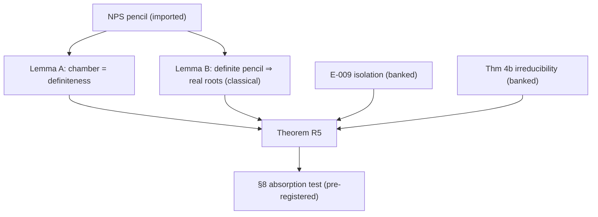

# RESEARCH_LOG ENTRY — R5: Total Reality in the Strict Physical Chamber — DRAFT v1

**Program:** Galois–k-Ellipse Horizon Program (with pre-registered feedback into the Mathematical Object Emergence Ledger, OBJ-004)
**Targets:** R5 (total reality via LMI line restriction), THM-005, PRED-003, Stage 4 items 1–2, and the pre-registered Helton–Vinnikov absorption test (ledger DEC-002 / queue item OBJ-004).
**Date:** 2026-07-10 (drafted on GO of same date)
**Document status:** **DRAFT — PROOF SUPPLIED. NOT ESTABLISHED. NOT ENACTED.**
Verification chain owed: this draft → external audit → counter-audit → GO → promotion. Per map §1 and guardrail 11, no downstream claim inherits ESTABLISHED status through this entry until sign-off. All register, map, and ledger deltas in §10 are **proposals**, drafted for one-flag enactment on GO. One log entry, one commit.
**Provenance / inputs:** Research map v1.3 (§2 bridge, §3.1 degree law, §3.1b leading-coefficient law, Branch D proof target, Branch E isolation results, §6 independent path, §7 Stage 4); LOG_ENTRY_R6_R7_generic_descent_v2.md (setup conventions §1; Thm 4b generic irreducibility; §9 isolation and two-mechanism arguments — **cited, not re-derived**); MATHEMATICAL_OBJECT_EMERGENCE_LEDGER v0.2 (OBJ-004 task design, §7 native-theorem promotion rule, loss-matrix real-fibered-morphisms row, E-007/E-008/E-009); NPS arXiv math/0702005 (verified 07-10 per map §11).

---

## 0. Purpose and placement

This entry executes the map's independent high-value path (§6):

```text
LMI / rigid convexity  ->  total reality theorem  ->  interlacing and
                                                      certified physical-root
                                                      selection
```

It proves the Branch D proof target — all roots of the axial polynomial are
real, hence all roots of `N_k(u)` are real and (as proved here, slightly
stronger than the target) **strictly positive** throughout the strict
physical chamber — and delivers Stage 4 items 1 and 2 (the pencil written in
black-hole variables; axis real-rootedness). Items 3 and 4 (interlacing,
certified selection) are opened, not claimed (§9).

Simultaneously it executes **OBJ-004** exactly as pre-registered in ledger
DEC-002: the proof is written first, then audited against the absorption
question — *is this verbatim Helton–Vinnikov / verbatim hyperbolicity theory
with symbols renamed?* The verdict (§8) is recorded either way; either
outcome moves a gate.



---

## 1. Setup and conventions

This entry works **pointwise over the reals**, the correct habitat for a
total-reality statement: fix `k >= 1` and a real parameter point

```text
(M, N) = (M, N_1, ..., N_k) ∈ R^{k+1}.
```

Generic-field inputs (Thm 4b irreducibility; the leading-coefficient law)
are cited where used and only there. Notation follows entry v2 §1:

```text
w_i(u) = sqrt(u + N_i^2)      (real branch, defined for u >= -min_i N_i^2),
Phi_k(m, M) = product_{eps in {+1,-1}^k} ( 4M - sum_i eps_i w_i(m^2) ),
Phi_k(m, M) = N_k(m^2)        (entry v2, Thm 2(iii)) — the map's p_k(m, 0).
```

Degree law (map §3.1, imported NPS + axial pairing):

```text
D_k = deg_m Phi_k = 2^k                      (k odd),
D_k = 2^k - binom(k, k/2)                    (k even),
deg_u N_k = D_k / 2.
```

**Strict physical chamber:**

```text
Cham = { (M, N) ∈ R^{k+1} : 4M > sum_i |N_i| }.
```

**Physical root.** On `u >= 0` the all-plus sheet
`g(u) = sum_i w_i(u)` is continuous, strictly increasing
(`g'(u) = (1/2) sum_i 1/w_i(u) > 0` for `u > 0`), with
`g(0) = sum_i |N_i|` and `g(u) -> ∞`. Hence for `(M,N) ∈ Cham` there is a
unique `u_phys` with `g(u_phys) = 4M`, and **`u_phys > 0` strictly** (since
`g(0) < 4M`). No genericity hypotheses are needed for this paragraph.

**Standing hypotheses (H1) `N_i != 0`, (H2) `N_i^2 != N_j^2`** are invoked
**only** in clause (v) (via Thm 4b) and are flagged there. Clauses (i)–(iv)
hold for every real `(M,N) ∈ Cham`, including on the (H1)/(H2) failure
strata — a scope note the auditor should confirm, since it is *broader* than
the standing-hypothesis regime of entry v2.

### 1.1 The NPS pencil in black-hole variables (Stage 4 item 1)

Let `σ_z = [[1,0],[0,-1]]`, `σ_x = [[0,1],[1,0]]`, and for `i = 1..k`

```text
Z_i = I_2^{⊗(i-1)} ⊗ σ_z ⊗ I_2^{⊗(k-i)},
X_i = I_2^{⊗(i-1)} ⊗ σ_x ⊗ I_2^{⊗(k-i)},
```

all symmetric `2^k × 2^k`. For foci `F_i = (0, N_i)` and radius `4M`, the
NPS construction specializes to the **affine symmetric pencil**

```text
A(x, y) = sum_i [ x·Z_i + (y - N_i)·X_i ],
L(x, y) = 4M·I_{2^k} - A(x, y).
```

Along the physical axis `y = 0`:

```text
L(m, 0) = L_0 - m·Z,
L_0     = 4M·I + sum_i N_i·X_i        (constant part; note A(0,0) = -Σ N_i X_i),
Z       = sum_i Z_i                    (axis direction).
```

This is the pencil "written explicitly in black-hole variables": the mass
`4M` sits on the diagonal, each charge channel `N_i` enters through one
tensor slot's `σ_x`, and the seed `m` couples through the total `σ_z`.

---

## 2. Imported and banked inputs

**(I-1) NPS spectral fact and determinantal representation** [IMPORTED,
NPS math/0702005; two-line proof included for self-containment]. The `k`
summands `S_i(x,y) = x·Z_i + (y - N_i)·X_i` act in distinct tensor slots,
hence pairwise commute; each has (slot-wise) eigenvalues
`± r_i`, `r_i = sqrt(x^2 + (y - N_i)^2)`. A commuting family of symmetric
matrices is simultaneously orthogonally diagonalizable, so the spectrum of
`A(x,y) = Σ_i S_i` is exactly

```text
spec A(x,y) = { sum_i eps_i·r_i : eps ∈ {±1}^k },      each eps once.
```

Consequently

```text
det L(x,y) = product_{eps} ( 4M - sum_i eps_i r_i ) = p_k(x, y),
```

and axially `det L(m, 0) = Phi_k(m, M) = N_k(m^2)` — the determinant and
the program's signed product are **identically equal as polynomials**, no
normalization constant. The spectrahedral region `{ L(x,y) ⪰ 0 }` is the
closed `k`-ellipse region (NPS).

**(I-2) Classical definite-pencil lemma** [classical linear algebra —
Gårding-easy direction of hyperbolicity; proof in §4 for self-containment].

**(B-1) Thm 4b** [ESTABLISHED, entry v2]: under (H1)/(H2), `N_k` is
irreducible over `F = F_0(M)` for every `k`. Used only in clause (v).

**(B-2) Leading-coefficient law §3.1b** [ESTABLISHED]: `lc(N_k)` is a
nonzero constant for odd `k` and `(-1)^{...}·(16M^2)^{b_k}·(positive)` for
even `k` — in particular nonvanishing whenever `M != 0`. Used in clause (v)
and Remark C.

**(B-3) Isolation arguments** [ESTABLISHED (prose), entry v2 §9; map Branch
E; ledger E-009]: against the all-plus sheet, every sheet difference is a
sum of the `w_i` with strictly positive coefficients; and the all-plus sheet
has `Σ_i 1/w_i > 0` on the chamber. **Cited and instantiated in clause
(iv), not re-derived.**

---

## 3. Lemma A — the strict chamber IS the definiteness locus

**Lemma A.** For every real `(M, N)`:

```text
L_0 = L(0,0) ≻ 0    ⟺    4M > sum_i |N_i|    ⟺    (M,N) ∈ Cham,
L_0 ⪰ 0             ⟺    4M >= sum_i |N_i|.
```

*Proof.* By (I-1) at `(x,y) = (0,0)`: `r_i(0,0) = |N_i|`, so
`spec A(0,0) = { Σ_i eps_i |N_i| }` with maximum `Σ_i |N_i|`. Then
`L_0 = 4M·I - A(0,0) ≻ 0` iff `4M > λ_max(A(0,0)) = Σ_i |N_i|`; likewise
for `⪰`. ∎

**Reading.** The strict physical (BPS) chamber and the hyperbolicity /
spectrahedral-interior chamber of the NPS pencil at the origin are **the
same set** — an identity, not an analogy. Geometrically: `(M,N) ∈ Cham` iff
the origin lies in the interior of the `k`-ellipse (map Branch D), and
Lemma A is that statement in LMI form. This identity is itself one of the
absorption-test findings (§8).

---

## 4. Lemma B — definite symmetric pencils are real-rooted along lines

**Lemma B (classical).** Let `L_0 ≻ 0` and `Z` be real symmetric `n × n`
matrices, and set `q(t) = det(L_0 - t·Z)`. Then:

```text
(a) deg q = rank Z, and lc(q) != 0;
(b) every root of q is real;
(c) counted with multiplicity, the number of positive (resp. negative)
    roots of q equals the number of positive (resp. negative) eigenvalues
    of Z (Sylvester inertia).
```

*Proof.* Let `R = L_0^{1/2} ≻ 0` (symmetric square root) and
`S = R^{-1} Z R^{-1}`, symmetric with real spectrum `μ_1, ..., μ_n`. Then

```text
q(t) = det(R(I - t·S)R) = det(L_0) · product_j (1 - t·μ_j).
```

Roots are exactly `t = 1/μ_j` for `μ_j != 0`, each real, with multiplicity
equal to that of `μ_j`; the factors with `μ_j = 0` are constant, so
`deg q = #{ j : μ_j != 0 } = rank S = rank Z` (congruence preserves rank),
with `lc(q) = det(L_0)·Π_{μ_j != 0}(-μ_j) != 0`. Signs of roots match signs
of the `μ_j`, and by Sylvester's law of inertia the congruent matrices `S`
and `Z` have the same signature. ∎

*Scope note for the auditor.* This is the **trivial direction** of the
hyperbolicity circle of ideas: a definite symmetric determinantal
representation forces real-rootedness along every line through the
definiteness point. The Helton–Vinnikov theorem is the **converse**
(existence of such representations for RZ plane curves) and is **nowhere
used** in this entry.

---

## 5. Theorem R5 — total reality, strict positivity, and physical-root rigidity

**Theorem R5.** Let `k >= 1` and `(M, N) ∈ Cham`. Then:

```text
(i)   [Chamber = definiteness]  L_0 ≻ 0, and Cham is exactly the parameter
      region where this holds (Lemma A).

(ii)  [Axial hyperbolicity]  q(m) := Phi_k(m, M) = det(L_0 - m·Z) satisfies
      deg_m q = rank Z = D_k, lc != 0, and EVERY root of q is real.
      q is even in m; its root multiset is symmetric under m -> -m.

(iii) [Total reality and strict positivity of the mass-square fiber]
      Every root of N_k(u) — all D_k/2 of them, physical and shadow —
      is real and STRICTLY POSITIVE. In particular N_k(0) = det L_0 > 0:
      u = 0 is never a root on the strict chamber.

(iv)  [Physical-root rigidity — unconditional]  u_phys > 0 and u_phys is a
      SIMPLE root of N_k, for EVERY (M,N) ∈ Cham. No genericity: this
      clause does not require (H1) or (H2).

(v)   [Generic simplicity — all roots]  Assume (H1), (H2). Then
      Disc_u N_k, as a real polynomial in (M, N), is not identically zero;
      the exceptional set Sigma = { (M,N) ∈ Cham : Disc_u N_k = 0 } is a
      proper relatively-closed real-algebraic subset (measure zero), and
      for (M,N) ∈ Cham \ Sigma all D_k/2 roots of N_k are simple. On all
      of Cham, any multiple root is a shadow-sector root: by (iv) the
      physical root never participates.
```

*(iii) is strictly stronger than the map's Branch D target ("real and
nonnegative"): on the strict chamber, nonnegativity sharpens to positivity,
with `u_phys -> 0` occurring exactly in the closed-chamber limit — Remark B.*

---

## 6. Proof

**(i)** Lemma A. ∎

**(ii)** By (I-1), `q(m) = det L(m,0) = det(L_0 - m·Z)`. Lemma B(a),(b)
with `n = 2^k` gives real-rootedness and `deg q = rank Z` with `lc != 0`.
The spectrum of `Z = Σ_i Z_i` is `{ s_eps = Σ_i eps_i : eps ∈ {±1}^k }`
(same commuting-slot argument as (I-1) with `x = 1, y = N_i`), so

```text
rank Z = 2^k - #{ eps : s_eps = 0 }
       = 2^k                          (k odd)
       = 2^k - binom(k, k/2)          (k even)
       = D_k,
```

matching the imported degree law — Remark C records this as a consistency
cross-check, not a new proof of the law. Evenness: `w_i(m^2)` is even in
`m`, so every factor pair `(eps, -eps)` of `Phi_k` is even; alternatively
Remark A gives the matricial proof. ∎

**(iii)** `q(m) = N_k(m^2)` is a polynomial identity over `R`, hence holds
for all complex `m`. Let `u_0 ∈ C` be any root of `N_k` and pick `m_0 ∈ C`
with `m_0^2 = u_0`. Then `q(m_0) = N_k(u_0) = 0`, so by (ii) `m_0 ∈ R`,
hence `u_0 = m_0^2 ∈ R_{>=0}`. Strict positivity: `N_k(0) = q(0) =
det(L_0) > 0` by (i), so `u_0 != 0`. Hence every root is real and `> 0`. ∎

**(iv)** Set `u_* = u_phys > 0` (§1). Then `u_* + N_i^2 > 0` for every `i`
— including any `i` with `N_i = 0` — so each `w_i(u)` is real-analytic and
strictly positive on a real neighborhood of `u_*`, and near `u_*`

```text
N_k(u) = product_{eps} ( 4M - s_eps(u) ),      s_eps(u) = Σ_i eps_i w_i(u),
```

is a product of analytic factors. Order of vanishing at `u_*` is the sum of
the factor orders:

- *No shadow factor vanishes* (E-009 mechanism 1, instantiated): for
  `eps != (+,...,+)`,

  ```text
  4M - s_eps(u_*) = (4M - g(u_*)) + 2·Σ_{i : eps_i = -1} w_i(u_*)
                  = 0 + 2·(a nonempty sum of strictly positive terms) > 0.
  ```

- *The all-plus factor vanishes simply* (E-009 mechanism 2, instantiated):
  `d/du [ 4M - g(u) ]|_{u_*} = -(1/2) Σ_i 1/w_i(u_*) < 0 != 0`.

Hence `ord_{u_*} N_k = 1`. Neither (H1) nor (H2) was used: only
`u_* > 0`, which is supplied by chamber strictness. ∎

**(v)** Under (H1)/(H2), Thm 4b (B-1) gives `N_k` irreducible over
`F = F_0(M)`; in characteristic zero irreducible implies separable, so
`Res_u(N_k, dN_k/du) != 0` in `F`. That resultant is a polynomial in the
coefficients of `N_k`, hence a polynomial `R(M, N)` with rational
coefficients, not identically zero. On `Cham` with (H1) we have
`Σ_i |N_i| > 0`, hence `M > 0`, hence `lc(N_k) != 0` by (B-2); therefore
`Disc_u N_k = ± R(M,N)/lc(N_k)^{...}` is a well-defined rational function
on `Cham`, vanishing exactly on the proper real-algebraic set
`Sigma = {R = 0} ∩ Cham`. Off `Sigma`, all `D_k/2` roots are simple. The
confinement of multiplicity to the shadow sector on all of `Cham` is
exactly (iv). ∎

---

## 7. Remarks

**Remark A (matricial deck avatar).** Let `X_all = σ_x^{⊗ k}`, an
orthogonal involution. Slot-wise `σ_x σ_z σ_x = -σ_z` and
`σ_x σ_x σ_x = σ_x`, so

```text
X_all · Z · X_all = -Z,        X_all · L_0 · X_all = L_0,
X_all · L(m,0) · X_all = L(-m, 0),
```

whence `q(m) = q(-m)` — a second proof of evenness. Structurally: **the
deck transformation `τ : m -> -m` acts on the NPS pencil as conjugation by
the total spin flip**, and the pencil's `Ad(X_all)`-even part is exactly
`L_0` while its odd part is `m·Z` — the invariant/anti-invariant split of
Branch B/F acquires a linear-algebra avatar inside the LMI representation.
Remark-grade; recorded for Branch B item 3 and Branch F, not promoted.

**Remark B (closed-chamber limit and BPS contact).** On the boundary
`4M = Σ|N_i|`: `L_0 ⪰ 0` becomes singular, and with `M > 0` (guaranteed
when some `N_i != 0`) the leading coefficient (B-2) stays nonzero, so the
roots of `N_k` vary continuously; real-rootedness and nonnegativity pass to
the closed chamber by taking limits, with `u_phys -> 0` — the physical root
lands on the all-plus component of the signed axial-contact divisor
`u = 0`, i.e. exactly the static BPS/extremal contact locus of R18. The
strict-chamber positivity (iii) degenerates only there and only through the
physical root's arrival at the wall. Remark-grade (limit argument sketched,
not audited-grade); the strict-chamber theorem is the claim of record.

**Remark C (degree and inertia cross-checks).** `rank Z = D_k` re-derives
the axial degree law from the pencil — a consistency check against map
§3.1, flagged as such. Lemma B(c) further gives: the number of positive
roots of `q`, with multiplicity, equals `#{ eps : s_eps > 0 } = D_k/2`.
Hence **all** `D_k/2` roots of `N_k` arise from the positive-`m` half-axis,
one per unbalanced sign-pair — the inertia of `Z` counts the mass-square
fiber. (`k = 4`: signature counts 5 positive, 5 negative, 6 zero;
5 = deg_u N_4. ✓)

**Remark D (Branch I sentence upgraded).** Branch I's opening observation —
"the physical chamber produces totally real specializations of a
nonsolvable field" — is, for the static family, no longer an empirical
observation: clauses (iii) + Thm 4b make *every* strict-chamber
specialization of the generic `S_5` quintic (k = 4) totally real with all
roots positive. Totally real `S_5` arithmetic is thus available at **every**
chamber point, not just sampled ones.

**Remark E (what strictness buys).** All uses of chamber strictness are
localized: (i) definiteness of `L_0`; (iii) `q(0) > 0`; (iv) `u_phys > 0`.
Weakening to the closed chamber costs exactly the strictness of (iii) and
touches (iv) only at the wall (where `u_phys = 0` and, if some `N_i = 0`,
`w_i(0) = 0` breaks the isolation instantiation) — consistent with Remark B.

---

## 8. Pre-registered absorption test (OBJ-004, ledger DEC-002)

**Registered question** (verbatim intent from DEC-002 / queue row OBJ-004):
*if the proof is verbatim Helton–Vinnikov with symbols renamed, the theorem
does NOT count as native (§7 rule) and the chamber datum is absorbed —
either outcome moves a gate.*

**Finding 1 — literal answer: NO.** The Helton–Vinnikov theorem (every RZ
plane curve admits a definite symmetric determinantal representation — the
*converse* direction) is nowhere invoked. The entry consumes a
representation that NPS *supply*; HV existence is never needed.

**Finding 2 — honest answer for the reality core: ABSORBED.** The
pre-registered question's intent is absorption by the hyperbolicity parent,
not by one theorem's name. On that reading, clauses (i)–(iii)'s reality
content is a **verbatim instance of classical hyperbolicity theory**:
definite pencil at a point ⇒ real-rootedness along lines through it
(Lemma B, Gårding-easy direction), applied to an imported representation
(NPS). Lemma A shows the chamber datum `C`, *as used for reality*,
coincides identically with the hyperbolicity/spectrahedral chamber of the
pencil — it contributes **no data beyond the pencil**. Per the ledger's §7
promotion rule, the bare total-reality clause is **TRANSLATED, not
native**, and must not count alone toward G4-02.

**Finding 3 — the native residue: NOT absorbed.** Three components of
Theorem R5 have no statement inside hyperbolicity theory:

```text
(a) Strict positivity of the u-fiber (iii): reality of m-roots is
    converted to positivity of u-roots by the deck parity (evenness =
    tau-invariance, Remark A). A joint C × G statement — hyperbolicity
    theory has no involution to quotient by. (REM-002/REM-003 pattern.)

(b) Physical-root rigidity (iv): hyperbolicity theory has NO distinguished
    root. Unconditional simplicity of the PHYSICAL root is the isolation
    theorem (E-009) restricted to the reality slice — a joint
    C × s_phys × W statement. This clause survives absorption entirely.

(c) The identity of Lemma A itself: "physical BPS chamber = hyperbolicity
    chamber" is a bridge theorem upgrading REM-002 from 'chamber geometry
    and deck parity remain disconnected in every parent' to 'identified,
    in the founding family, with a proof that uses the identification.'
```

**Verdict: SPLIT.**

```text
Absorbed:      the chamber datum C as a reality-datum; the bare
               total-reality clause (Gårding/NPS instance).
Not absorbed:  branch selection s_phys, deck parity G, wall structure W
               as they enter (iii)-positivity and (iv)-rigidity.
```

The split lands exactly on the loss-matrix row as originally written
("Structure lost or externalized: deck-parity thermodynamic grading,
norm-wall BPS meaning, solvability obstruction") — the reduction keeps what
that row said it keeps and loses what it said it loses. This is the §16
pattern: *the essential datum lost by the strongest serious reduction is
the selection* — consistent with the program thesis "universality is
descent; the physics is the selection."

**Gate consequences (either-way clause honored):** the loss-matrix
absorption threat resolves from OPEN-THREAT to a precise SPLIT verdict
(gate moved); G4-02 gains one candidate — the composite (iii)+(iv), which
satisfies §7 rules 1 (relates LMI, Galois/invariant, and thermodynamic
parents) and 3 (states an obstruction/selection fact no single parent
formulates). Recommendation to the reviewer: **count the composite as one
native theorem; do not count the bare reality clause.** Ruling deferred to
sign-off.

---

## 9. What this entry does NOT prove

```text
1. Interlacing of roots under variation of M or charges (Stage 4 item 3) —
   opened by (ii)+(v), not claimed.
2. A certified eigenvalue/root-selection algorithm for u_phys
   (Stage 4 item 4) — the pencil + inertia count (Remark C) is the design
   input; nothing is implemented, no Cella run occurred (no GO given for
   runs).
3. Anything about Galois or monodromy groups. R9 untouched.
4. Real-rootedness OFF the closed chamber, or for planar (non-axial) line
   restrictions not through a definiteness point.
5. The closed-chamber boundary statements beyond Remark B's sketch grade.
6. Any strengthening of R18's infinite-place sweep; untouched.
7. The Helton–Vinnikov converse plays no role and no claim about definite
   representations of OTHER curves in the program is made.
```

---

## 10. Proposed register / map / ledger deltas — **PENDING AUDIT, NOT ENACTED**

Drafted for one-flag enactment on GO; per guardrail 11 and ledger §14
step 5, nothing below changes status until the audit chain completes.

### 10.1 Map (v1.3 → v1.4 candidates)

```text
R5:        PROOF-READY  ->  PROOF SUPPLIED (this entry)  ->  [ESTABLISHED on GO].
           Strengthened statement: strictly positive, not merely nonnegative;
           physical-root simplicity unconditional on the strict chamber.
Branch D:  proof target discharged (pending); "Payoff" line activates —
           interlacing/eigenvalue methods now have their theorem.
Stage 4:   items 1–2 -> DONE (pending); items 3–4 become the live front of
           this path.
§6:        independent path's first edge ESTABLISHED (pending); frontier
           moves to interlacing/certified selection.
Guardrail candidate (new): "Total reality is a strict-chamber theorem.
           Do not claim real-rootedness for arbitrary line restrictions of
           p_k, nor off the closed chamber."
Remark A:  feed to Branch B item 3 / Branch F as a recorded observation.
Remark D:  fold into Branch I preamble on enactment.
```

### 10.2 Ledger (v0.2 → v0.3 candidates)

```text
E-007:   PROOF-READY -> SUPERSEDED by E-012 (link, do not erase).
E-012:   [new] Theorem R5 package: chamber=definiteness identity; total
         reality; strict positivity via deck parity; unconditional
         physical-root simplicity. Status on enactment: PROVED.
         Supports: REM-002, REM-003, NS-001, NS-004, THM-005, PRED-003.
PRED-003: OPEN -> CONFIRMED (strengthened: strictly positive).
THM-005: PROOF-READY -> PROVED with SPLIT annotation: bare reality clause
         TRANSLATED (does not count toward G4-02); composite
         (positivity-by-parity + physical-root rigidity) is the
         candidate-native form (counts once, per §8 recommendation —
         reviewer to ratify).
Loss matrix, real fibered morphisms / hyperbolicity row:
         "Strongest absorption threat — tested by OBJ-004"
         -> "TESTED (OBJ-004, E-012): absorbs the reality clause completely
         (chamber = hyperbolicity region, exact identity); does NOT absorb
         s_phys (no distinguished root), G-parity (no involution), or W
         (no wall meaning). Verdict: SPLIT — realization-strength parent
         for reality, incomplete owner."
NS-001:  note appended — for reality purposes C is representable inside
         the pencil (not extra data); the isolation-axiom candidate is
         unaffected and is now exercised by E-012(iv).
OBJ-004: OPEN -> COMPLETE (pending audit); DEC-002 revisit trigger fires
         on enactment.
DEC-003: [new decision row, drafted] "Enact §10 deltas; ratify the split
         native-count ruling for THM-005; hold CAND-001 at S2 (G3-05 still
         BLOCKED — this task was never a third realization); next queue
         item: OBJ-002 / PRED-006."
```

### 10.3 Paper feed (Stage 1, deferred by standing sequencing)

Stage 1 remains parked until Stage 2 + R5 complete **their audit chains**
(map §7 sequencing note). On enactment, the paper gains: the pencil in
black-hole variables; the chamber=definiteness identity; total reality with
strict positivity; the inertia count of the mass fiber; the `τ`-as-spin-flip
remark. The `τ(T_+) = T_-` correction (Stage 1 item 1) is unchanged and
still owed.

---

## 11. Verification record and remaining queue

```text
Chain state:  DRAFT (this document). External audit OWED. Counter-audit
              OWED. GO for promotion OWED. No repo action taken; no
              commits; no Cella executions (no GO was given for runs).

Audit focus suggestions (where an auditor should press):
  a. §6(iii): the complex-root argument (polynomial identity over C;
     both square roots handled).
  b. §6(iv): analyticity neighborhood (u_* + N_i^2 > 0 including N_i = 0)
     and the claim that (H1)/(H2) are genuinely unused.
  c. §6(v): the Res-to-Disc bookkeeping with non-monic N_k and the lc
     nonvanishing citation (B-2) — chamber gives M > 0 only under
     some N_i != 0; confirm the (H1) placement covers it.
  d. Lemma B(c) inertia claim (congruence, multiplicities).
  e. §8 Finding 2: confirm the "intent" reading of the pre-registered
     question is legitimate rather than goalpost-moving; the literal
     answer is recorded separately (Finding 1) precisely so the reviewer
     can rule on either reading.

Optional Cella certificates (queued, NOT executed — cross-checks only):
  a. Exact rational chamber witness, e.g. (M, N) = (2, 1, 1, 1, 1):
     certify L_0 ≻ 0 by exact leading principal minors / LDL^T over Q.
  b. Point B (k = 4): exact interval isolation of all 5 roots of N_4;
     verify all > 0 and simple; locate u_phys's interval.
  c. Symbolic rank check: rank Z = 10 at k = 4; inertia (5, 5, 6).

One log entry, one commit (on Will's side, path-scoped add, post-GO only).
```
