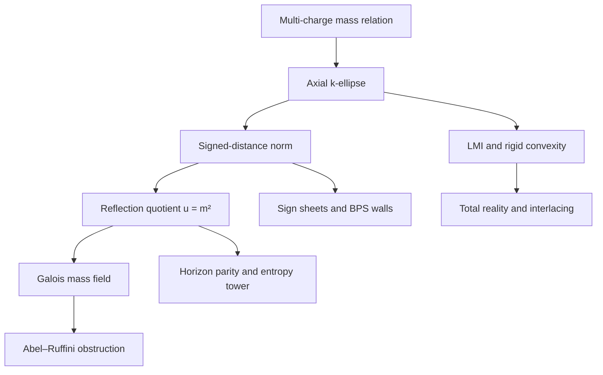
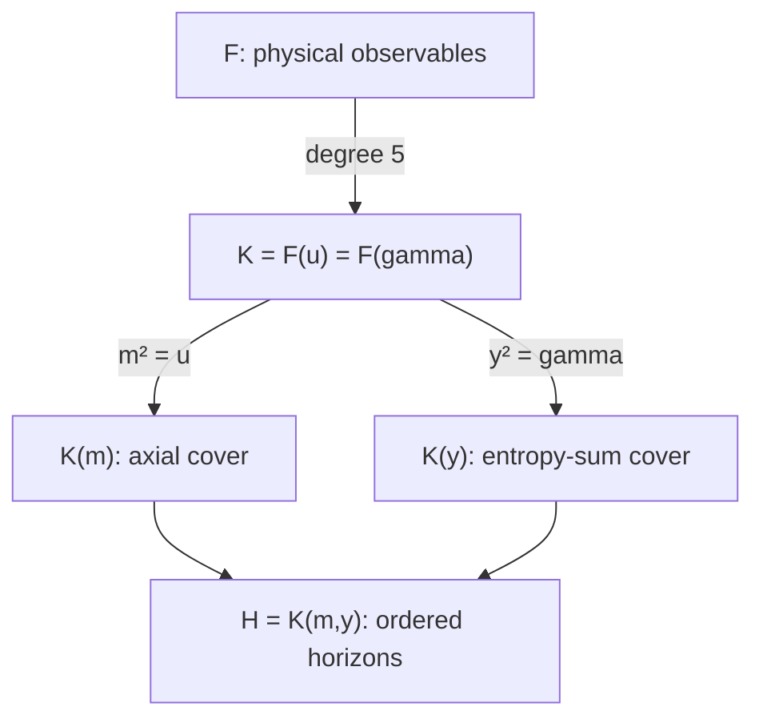
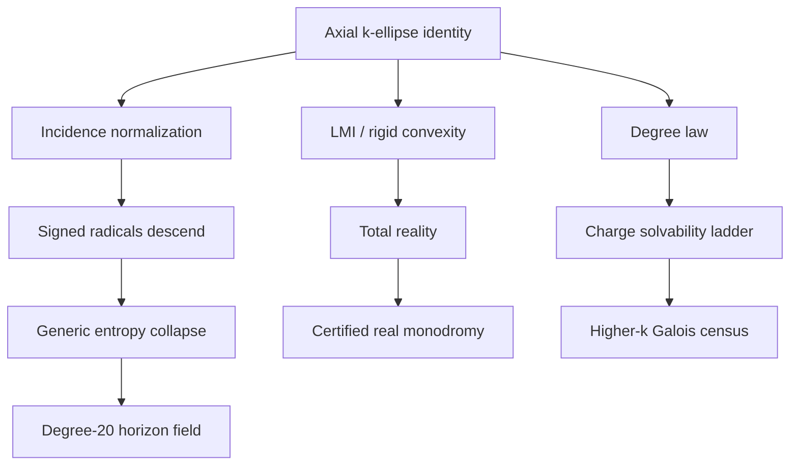

# Galois–k-Ellipse Horizon Program — Research Map

**Date:** 2026-07-10  
**Purpose:** Maintain the branch structure created by identifying the multi-charge mass fiber with an axial section of an algebraic `k`-ellipse.  
**Central physical family:**

```text
4M = sum_{i=1}^k sqrt(m^2 + N_i^2),
N_i = 4Q_i,
u = m^2.
```

## 1. Status vocabulary

| Label | Meaning |
|---|---|
| **IMPORTED** | A theorem already established in the external mathematical or physical literature. |
| **ESTABLISHED** | Proved symbolically or by an exact certificate in the current black-hole program. |
| **PROOF-READY** | A precise consequence with a clear proof route; one stated lemma or certificate remains. |
| **PREDICTED** | A sharp, testable mathematical prediction. |
| **EXPLORATORY** | A plausible research connection whose correct formulation is not yet fixed. |

The program should promote claims only in that order. Numerical agreement is evidence, not promotion by enthusiasm.

## 2. The bridge in one statement

Let

```text
P = (m,0),
F_i = (0,N_i),
d(P,F_i) = sqrt(m^2 + N_i^2).
```

Then the mass relation is the intersection of the planar `k`-ellipse

```text
E_k(4M)
 = { (x,y) : sum_i sqrt(x^2 + (y-N_i)^2) = 4M }
```

with the physical half-axis

```text
y = 0,
x = m >= 0.
```

The signed-radical norm is the axial restriction of the algebraic `k`-ellipse polynomial:

```text
p_k(x,y)
 = product_{eps in {+1,-1}^k}
   [4M - sum_i eps_i sqrt(x^2 + (y-N_i)^2)],

p_k(m,0) = N_k(m^2).
```

This single identification links black-hole thermodynamics to multifocal geometry, convex algebraic geometry, symmetric determinantal representations, hyperbolic polynomials, invariant theory, Galois theory, wall arrangements, and exact certified computation.



## 3. The immutable trunk

### 3.1 Degree law

Nie–Parrilo–Sturmfels prove that the algebraic `k`-ellipse has planar degree

```text
D_k = 2^k                              if k is odd,
D_k = 2^k - binom(k,k/2)               if k is even.
```

Because the physical axis restriction is even in `m`, the signed mass norm has

```text
deg_u N_k
 = 2^(k-1)                             if k is odd,
 = 2^(k-1) - (1/2)binom(k,k/2)         if k is even.
```

The direct axial proof pairs `eps` with `-eps`. Writing

```text
s_eps = sum_i eps_i,
```

each unbalanced sign-pair contributes one power of `u`; each balanced pair with `s_eps=0` contributes none.

| `k` | Planar/`m` degree `D_k` | `u=m^2` norm degree | Status |
|---:|---:|---:|---|
| 1 | 2 | 1 | **IMPORTED + ESTABLISHED** |
| 2 | 2 | 1 | **IMPORTED + ESTABLISHED** |
| 3 | 8 | 4 | **IMPORTED + ESTABLISHED** |
| 4 | 10 | 5 | **IMPORTED + ESTABLISHED** |
| 5 | 32 | 16 | **ESTABLISHED norm degree** (pairing theorem + constructor run 07-10); minimal/physical degree PREDICTED (irreducibility open) |
| 6 | 44 | 22 | **ESTABLISHED norm degree** (pairing theorem, general proof); minimal/physical degree PREDICTED |

Important distinction:

```text
deg N_k(u) = delta_k
```

is a theorem about the signed norm. The physical seed has minimal degree `delta_k` only after irreducibility is proved for the axial specialization.

### 3.1b Leading-coefficient law **[ESTABLISHED 07-10; was missing from v1.0]**

With `b_k = (1/2)binom(k,k/2)` balanced pairs (even `k`; zero for odd):

```text
lc(N_k) = (-1)^(2^(k-1) - b_k) * (16 M^2)^(b_k) * product_{s_eps > 0} s_eps^2.
```

Odd `k`: sign `+`, `M`-free, and a PERFECT SQUARE of the hyperoctahedral product
`prod_{s_eps>0} s_eps` (k=3: lc = 9; k=5: lc = 1215^2 = 1476225 — both certified
with symbolic `M`). Even `k`: reproduces the certified `k=4` value `-2^24 M^6`
(the `M`-weight of the leading coefficient lives entirely in the balanced
(k/2,k/2) pair-decay classes).

**Corollary (odd-`k` wall identity, certified at k=5):**

```text
prod(branches) = 4^(2k) * product_{2^k walls} (M ± Q_1 ± ... ± Q_k) / lc,
```

with a CONSTANT denominator at odd `k` (k=5: 1215^2), versus `M^6` at `k=4`.
Note for Branch D: the odd-`k` positive-perfect-square normalization is
determinantal-friendly; parity of the focus count should appear structurally
in the NPS pencil.

### 3.2 Four-charge Galois core

For `k=4`:

```text
F = Q(M,Q_1,Q_2,Q_3,Q_4),
K = F(u),
[K:F] = 5,
Gal(K^gal/F) = S_5.
```

Consequences already certified:

```text
u = m^2 is not expressible in radicals over F;
the generic four-charge boost parametrization is radical-one-way;
the static squared entropy sum generates the same quintic field;
the entropy sum and the individual horizons are not radical functions of F.
```

The new geometric interpretation is:

```text
The first nonsolvable black-hole mass inversion is the reflection quotient
of the first axial k-ellipse whose quotient degree exceeds four.
```

## 4. Canonical cover tower

Define in the static four-charge case:

```text
w_i^2 = u + N_i^2,
sum_i w_i = 4M,
P = product_i N_i,

alpha = e_4(w) + u e_2(w) + u^2,
beta  = e_3(w) + u e_1(w),

A = alpha + m beta = product_i(w_i+m),
B = alpha - m beta = product_i(w_i-m),
AB = P^2.
```

Normalize the entropy variables by

```text
y = (S_+ + S_-)/pi,
z = (S_+ - S_-)/pi.
```

Then

```text
y^2 = 2(alpha+P) =: gamma,
z^2 = 2(alpha-P),
y*z = 2m beta,

S_+/pi = (y+z)/2,
S_-/pi = (y-z)/2.
```

The field architecture is therefore:



Current degree ledger:

| Field/object | Degree over `F` | Status |
|---|---:|---|
| `K=F(u)=F(gamma)` | 5 | **ESTABLISHED** |
| `K(m)` | 10 | **ESTABLISHED 07-10**: `E_u = Res(N, Y^2-u)` irreducible deg 10 at B; plus prose proof (wall norm has 16 distinct linear factors at odd exponent, `256/M^6` a square) |
| `K(y)` | 10 | **ESTABLISHED by irreducible degree-10 entropy-sum polynomial** |
| `K(m,y)` | 20 | **ESTABLISHED 07-10**: `E_{u*gamma}` irreducible deg 10 at B ⇒ `[u],[gamma]` independent in `K*/K*^2` ⇒ `Gal(K(m,y)/K) = V_4`; generic by specialization |

The decisive degree-20 test — `u*gamma` not a square in `K` — **was run and
passed on 2026-07-10** (RESEARCH_LOG Entry 4): `u`, `gamma`, `u*gamma` all
non-squares at point B, hence `[u]` and `[gamma]` independent in `K^*/K^{*2}`,
hence:

```text
[K(m,y):K] = 4,
[K(m,y):F] = 20,
Gal(K(m,y)/K) = V_4        [ESTABLISHED at B; generic by specialization].
```

**Still open (do not conflate):** the Galois group of the CLOSURE of `K(m,y)`
over `F` — the full monodromy of the ordered-horizon cover (a subgroup of a
degree-20-compatible extension of `S_5` by 2-groups). That is register R9.

## 5. Branch map

### Branch A — Multifocal algebraic geometry

**Imported mathematics**

```text
k-ellipse degree theorem;
signed-distance defining polynomial;
symmetric determinantal representation;
normalization and algebraic sign sheets;
singularities and projective closure.
```

**Black-hole translation**

```text
foci       <-> charge channels N_i,
radius     <-> total mass 4M,
axis point <-> seed mass m,
reflection <-> m -> -m,
axis norm  <-> mass eliminant.
```

**Immediate theorem target**

```text
Prove that the signed-distance incidence curve is birational to the
normalization of the axial k-ellipse for generic independent charges.
```

**Payoff:** supplies the generic function-field home for every signed radical `w_i`.

---

### Branch B — Reflection invariant theory

The axial involution is

```text
tau(m) = -m,
tau(u) = u,
tau(w_i) = w_i.
```

The quotient is

```text
F(m) / <tau> = F(m^2) = F(u).
```

For static entropy:

```text
tau(A) = B,
tau(B) = A,
tau(S_+) = S_-,
tau(S_-) = S_+.
```

**Core new statement:** the horizon deck transformation is the axial reflection of the multifocal mass geometry.

**Next results**

1. Formalize the fixed-field theorem.
2. Determine the complete involution group on `K(m,y)`.
3. Separate horizon swap, simultaneous entropy-sign reversal, and charge-sign actions.

---

### Branch C — Galois and monodromy ladder

Known and predicted sequence:

```text
k=1: rational
k=2: rational
k=3: quartic, solvable
k=4: quintic with generic S_5, nonsolvable
k=5: degree-16 norm, group unknown
k=6: degree-22 norm, group unknown
```

**Do not assume** the higher groups are full symmetric groups. Determine them.

**Research questions**

```text
What is Gal(N_k/F) for generic k?
What subgroup constraints are inherited from signed-distance geometry?
How does monodromy act on sign sheets?
Which charge coincidences reduce the group?
What is the discriminant locus in charge-mass parameter space?
```

**Next decisive experiment:** generate `N_5(u)` at one small rational physical specialization, prove irreducibility, and obtain enough Dedekind cycle types to identify its transitive degree-16 Galois group.

---

### Branch D — Convex algebraic geometry, LMI, and hyperbolicity

Nie–Parrilo–Sturmfels provide

```text
p_k(x,y) = det L_k(x,y),

E_k = { (x,y) : L_k(x,y) >= 0 }.
```

The physical mass relation is therefore an axial boundary condition of a spectrahedron.

**Important scope:** the BPS inequality concerns feasibility of the physical axis section, not non-emptiness of the entire planar `k`-ellipse.

Along the physical axis:

```text
f(m) = sum_i sqrt(m^2+N_i^2),
f(0) = sum_i |N_i|,
f'(m) > 0 for m>0.
```

Hence a physical root exists exactly when

```text
4M >= sum_i |N_i|
```

and is unique for `m>=0`.

**Rigid-convexity consequence:** in the strict chamber

```text
4M > sum_i |N_i|,
```

the origin lies inside the `k`-ellipse and the axis passes through its interior. The determinantal polynomial restricted to that line is real-rooted.

**Proof target**

```text
All roots of p_k(m,0) are real;
because p_k is even, all roots of N_k(u) are real and nonnegative,
generically simple, throughout the strict physical chamber.
```

**Payoff:** upgrades sampled total reality into structural hyperbolicity and opens interlacing, eigenvalue, and condition-number methods.

---

### Branch E — Wall arrangements and BPS geometry

At the axial collapse `m=0`:

```text
4M - sum_i eps_i N_i = 0
```

becomes

```text
M - sum_i eps_i Q_i = 0.
```

For four charges:

```text
Norm_{K/F}(u)
 = 256/M^6
   product_{eps in {+1,-1}^4}
   (M + eps_1 Q_1 + eps_2 Q_2 + eps_3 Q_3 + eps_4 Q_4).
```

**Interpretation**

```text
signed focal sheets -> signed BPS walls,
physical sign chamber -> physical BPS inequality,
wall union -> zero locus of the Galois norm,
wall intersections -> higher degeneracy strata.
```

**Research directions**

1. Identify the wall arrangement as a signed hyperplane arrangement and compute its intersection lattice.
2. Relate discriminant multiplicities to wall intersections.
3. Determine whether lower quintic coefficients encode lower-dimensional wall strata.
4. Study charge permutations and sign changes as an action of the hyperoctahedral group.
5. Compare these walls with genuine marginal-stability walls in the underlying supergravity/string compactification.

The fifth item requires physics-specific care: algebraic wall factors and physical decay walls need not coincide automatically.

**Missing from v1.0 — two results already in hand (07-10):**

*Physical-sheet isolation theorem* **[ESTABLISHED, prose proof; write-up owed]**:
two sign branches `eps, eps'` share a root only where
`sum_i (eps_i - eps'_i) w_i = 0`; against the all-plus branch this is a sum of
strictly positive `w_i` — never zero. The physical sheet participates in NO
collision, for every `k`, everywhere on the real domain. Collisions are
confined to the shadow sector.

*Collision classification + certified strata* **[strata ESTABLISHED by run]**:
discriminant components are the signed sub-balance varieties
`sum_{i in D} sigma_i w_i = 0`. Among the real sheets of the physical chamber
these reduce to focal coincidences `N_i^2 = N_j^2`; certified factorizations:
all-equal charges ⇒ `(simple physical)(quadruple shadow)` — pattern (1,4);
one pair equal ⇒ multiplicities (1,2)+(irreducible cubic). Complex sub-balance
loci (e.g. `w_1 = w_2 + w_3`) exist off the real chamber and are the braid
generators for the monodromy campaign (R9/Q1). Degeneration lattice = partition
lattice of the focus set, with the physical sheet always outside it.

---

### Branch F — Thermodynamic parity and covariants

For Kerr–Newman, temperature is not a pure odd representation. The correct odd covariant is

```text
Theta := S*T,

Theta_+ =  sqrt(Delta)/(2M),
Theta_- = -sqrt(Delta)/(2M).
```

Thus

```text
sigma(Theta) = -Theta,
Theta^2 = Delta/(4M^2).
```

Temperature decomposes into even and odd parts:

```text
T_even = (T_+ + T_-)/2,
T_odd  = (T_+ - T_-)/2.
```

**New organizing principle**

```text
Horizon-even objects descend through the reflection quotient.
Horizon-odd objects are covariants of the axial reflection.
Mixed thermodynamic quantities are ratios or combinations of the two.
```

**Next targets**

1. Express the four-charge static `S*T` directly in `m,w_i` and prove its reflection parity.
2. Derive the sector first laws from the even/odd function-field decomposition.
3. Classify thermodynamic observables by invariant, anti-invariant, or mixed parity.
4. Reassess the charge-parity principle using focus-label representations.

---

### Branch G — Generic entropy descent and the full horizon field

The present pointwise certificates suggest

```text
w_i = g_i(u) in K = F[u]/(N_4).
```

The k-ellipse supplies the conceptual generic proof route:

```text
signed distances live on the normalized axis cover
    -> w_i in F(m)
    -> w_i fixed by m -> -m
    -> w_i in F(m)^tau = F(m^2) = K.
```

Then

```text
alpha,beta,gamma in K,
alpha^2 - u beta^2 = P^2,
y^2 = gamma,
z = 2m beta/y.
```

**Required proof package (statuses updated 07-10)**

1. Birational incidence/normalization lemma — **OPEN (critical path)**.
2. Generic fixed-field descent `w_i in K` — **OPEN (follows from 1)**.
3. Primitive-element proof `K=F(gamma)` — **DONE** (resolvent irreducible,
   S_5 witnesses p=17,19,23; generic by specialization).
4. Square-class independence of `u` and `gamma` — **DONE** (Entry 4:
   `E_u`, `E_{u*gamma}` both irreducible degree 10).
5. Exact degree and Galois/monodromy group of the ordered entropy cover —
   degree **DONE** (20, `V_4` over `K`); closure group over `F` **OPEN** (R9).

**The theorem, now established (at B; generic by specialization; conceptual
descent write-up owed for the fully generic proof of items 1–2):**

```text
The static ordered-horizon field is a degree-20 biquadratic lift
of a non-Galois quintic whose Galois closure is S_5.
```

---

### Branch H — Singularities, discriminants, and ramification

There are now several degeneracy loci — **with two identifications the v1.0
list missed (AUDIT CORRECTION 07-10):**

```text
1. BPS/axis contact:            m = 0;
2. horizon extremality:         S_+ = S_-;
3. mass-fiber discriminant:     Disc_u N_k = 0;
4. coincident foci:             N_i^2 = N_j^2;
5. entropy square branching:    gamma = 0;
6. ordered-horizon branching:   gamma - 4P = 0.
```

**Corrections (proven):**
- Locus 6 IS locus 2, identically: `z^2 = 2(alpha - P) = gamma - 4P`, so
  `gamma - 4P = 0  <=>  z = 0  <=>  S_+ = S_-`. Not two loci.
- STATICALLY, locus 2 (= 6) coincides with locus 1: `A, B > 0` on the physical
  branch and AM–GM gives `2 alpha = A + B >= 2 sqrt(AB) = 2P`, i.e.
  `alpha >= P`, with equality iff `A = B` iff `m*beta = 0` iff `m = 0`
  (since `beta = e_3(w) + 4Mu > 0`). Static extremality = BPS contact.
  The loci separate only once rotation enters (extremality at `a -> m`, `m != 0`).
- Locus 5 never meets the real physical branch: `gamma = 2(alpha + P) >= 4P > 0`
  there. It is a complex / other-chamber branching locus of `K(y)/K`.

Distinct loci that survive on the static physical family: {1 (= 2 = 6)},
{3}, {4 (⊂ 3, the real components)}, {5 (off-chamber)}. These should not be
conflated — nor double-counted.

**Research questions**

```text
Which loci coincide on physical subfamilies?
Which are branch divisors versus singularities of the total cover?
What inertia groups occur at each divisor?
How do wall intersections change ramification type?
Does axial tangency encode extremality or only seed collapse?
```

This branch is the natural meeting point with discriminant geometry, singularity theory, and monodromy.

---

### Branch I — Arithmetic and exact certification

The physical chamber produces totally real specializations of a nonsolvable field. This opens:

```text
totally real S_5 quintic arithmetic;
field discriminants and ramified primes;
integral models under quantized charges;
Chebotarev/Dedekind certification;
Hilbert irreducibility across physical parameter regions;
certified root isolation and chamber tracking.
```

**Cella role**

```text
exact norm construction;
exact polynomial reduction;
Dedekind factorization witnesses;
independent interval isolation of physical roots;
certificate-producing LMI positivity tests;
exact square-class and resultant checks.
```

This is a direct application of Cella's intended identity: court, not calculator.

---

### Branch J — Generalized multifocal black-hole families

The external theory already extends to weighted `k`-ellipses and higher-dimensional `k`-ellipsoids.

Potential translations:

```text
weighted distances    <-> unequal charge couplings or scalar dressings;
higher-dimensional foci <-> several seed/modulus variables;
moving foci           <-> moduli-dependent dressed charges;
indefinite forms      <-> rotation or Lorentzian/pseudo-Euclidean extensions;
different radius law <-> gauged or cosmological-constant deformations.
```

**Guardrail:** these are analogies until a specific black-hole elimination relation is derived in the corresponding form.

Best targets:

1. Static STU subfamilies with nontrivial scalar moduli.
2. Five-dimensional three-charge black holes.
3. Rotating four-charge entropy cover over the same mass fiber.
4. Gauged/AdS families, testing whether the multifocal structure survives or deforms.
5. Weighted charge channels arising from nonuniform normalization.

---

### Branch K — Connection to DBP role geometry

This bridge touches the existing DBP program at several structural points, but no equivalence should yet be claimed.

| DBP structure | Multifocal/Galois analogue | Status |
|---|---|---|
| Role-labelled channels | Focus-labelled charge distances | **STRUCTURAL LINK** |
| Passive `S_k` relabelling | Permutation of foci/charges | **EXACT SYMMETRY** |
| Active role recharting | Solving/eliminating through a chosen charge/focus branch | **EXPLORATORY** |
| Sign/gauge transport | Signed-distance sheet changes | **EXPLORATORY** |
| Collapsing divisors | BPS, discriminant, and entropy branch divisors | **DIRECT TEST TARGET** |
| Inverse-channel local curvature | Local geometry near wall/discriminant strata | **EXPLORATORY** |
| Canonical invariant reduction | Passage to symmetric functions and reflection quotient | **STRONG STRUCTURAL LINK** |

**Most productive DBP test:** apply the local curvature calculus to the discriminant and BPS-wall arrangement of the mass/entropy cover, with each charge treated as an active role channel. Determine whether DBP curvature carriers distinguish ramification types or wall-intersection strata.

## 6. Dependency map



The critical path is:

```text
incidence normalization
    -> generic radical descent
    -> exact field tower
    -> full horizon-cover group.
```

The independent high-value path is:

```text
LMI / rigid convexity
    -> total reality theorem
    -> interlacing and certified physical-root selection.
```

## 7. Priority campaign sequence

### Stage 1 — Freeze the corrected core

1. Replace “temperature is Galois-odd” with the `S*T` odd-covariant theorem.
2. Insert the axial `4`-ellipse identification and the imported degree theorem.
3. Separate degrees `5`, `10`, and `<=20` throughout the paper.
4. State the entropy result as static until rotation is certified.

### Stage 2 — Prove the geometric descent

1. Define the signed-distance incidence curve.
2. Prove birationality to the normalized axial curve.
3. Prove `w_i in K` by reflection-fixed descent.
4. Replace the point-B radical-collapse lemma with the generic theorem.

### Stage 3 — Close the full static horizon cover **[COMPLETE 07-10, except item 4b]**

1. Prove `u` nonsquare in `K` — **DONE** (wall-norm odd-exponent prose proof
   + exact certificate `E_u` irreducible).
2. Retain the degree-10 proof that `gamma` is nonsquare — **RETAINED**.
3. Test and prove `u*gamma` nonsquare — **DONE** (`E_{u*gamma}` irreducible).
4. Establish degree `20` — **DONE** (`V_4` lift certified); identify the
   complete Galois/monodromy group of the closure — **OPEN → R9**.

### Stage 4 — Import convex geometry fully

1. Write the symmetric matrix pencil `L_4` explicitly in black-hole variables.
2. Prove axis real-rootedness in the strict physical chamber.
3. Derive root interlacing under variation of `M` and charges.
4. Build a certified eigenvalue/root-selection algorithm for the physical seed.

### Stage 5 — Map the wall and discriminant strata

1. Factor or stratify `Disc_u N_4`.
2. Compute the intersection lattice of the sixteen signed walls.
3. Determine inertia/monodromy at generic walls and their intersections.
4. Compare algebraic walls with physical marginal-stability conditions.

### Stage 6 — Open the higher-charge census

1. Construct `N_5(u)` without uncontrolled expansion.
2. Confirm degree `16` and isolate the physical root.
3. Prove one irreducible physical specialization.
4. Determine its degree-16 Galois group.
5. Repeat selectively for weighted or higher-dimensional physical families.

## 8. Research-direction register

| ID | Direction | Current status | Next decisive result | Expected value |
|---|---|---|---|---|
| R1 | Axial `k`-ellipse identification | **ESTABLISHED** | Formal proposition and citation | Foundational |
| R2 | General mass-norm degree formula | **IMPORTED + DERIVED AXIALLY** | Write direct sign-pair proof | High |
| R3 | Generic `S_5` at four charges | **ESTABLISHED** | Publish exact witnesses | Foundational |
| R4 | BPS wall norm | **ESTABLISHED** | Direct symbolic proof in paper | Very high |
| R5 | Total reality in physical chamber | **PROOF-READY** | LMI line-restriction proof | Very high |
| R6 | Incidence normalization | **PROOF-READY** | Birationality lemma | Critical |
| R7 | Generic radical descent `w_i in K` | **PROOF-READY** | Fixed-field theorem | Critical |
| R8 | Degree-20 ordered horizon field | **ESTABLISHED 07-10** (V_4 at B; generic) | Descent write-up for fully generic proof | Very high |
| R16 | Leading-coefficient law (all `k`; odd-`k` square; odd-`k` wall identity) | **ESTABLISHED** | Fold into paper App. B | High |
| R17 | Physical-sheet isolation + collision classification (sub-balance loci) | **ESTABLISHED (prose)** | Formal write-up; feeds R9/R12 | Very high |
| R9 | Full horizon-cover group | **OPEN** | Resolvent/monodromy computation | Very high |
| R10 | Five-charge degree-16 irreducibility | **PREDICTED** | One exact specialization | High |
| R11 | Generic higher-`k` Galois groups | **OPEN** | `k=5` group census | Program-forming |
| R12 | Wall/discriminant ramification | **OPEN** | Factor `Disc_u N_4` | Very high |
| R13 | Rotating entropy obstruction | **OPEN** | Extend `alpha,beta` tower with `J` | High |
| R14 | Weighted multifocal black holes | **EXPLORATORY** | Derive one physical weighted relation | Potentially high |
| R15 | DBP curvature of cover divisors | **EXPLORATORY** | One exact local-curvature case | Cross-program |

## 9. Guardrails against accidental overclaim

Do not currently claim:

```text
1. Temperature itself is Galois-odd.
2. The CLOSURE group of the degree-20 horizon field over F equals any specific
   extension (e.g. S_5 x V_4) — degree 20 and V_4-over-K are certified;
   the closure group is R9, open.
3. The degree-16 five-charge norm is irreducible.
4. The five-charge group is S_16.
5. Every algebraic signed wall is automatically a physical decay wall.
6. The entropy radical collapse is generic solely because point B passes
   (the exact-certificate chain gives genericity by specialization for the
   FIELD statements; the DESCENT w_i in K is generic only after the
   normalization lemma — do not conflate the two).
7. Rotation, gauging, or extra moduli preserve the k-ellipse form without derivation.
8. Axial BPS feasibility is the same as non-emptiness of the full planar k-ellipse.
9. The DBP and multifocal constructions are already equivalent theories.
10. The sector first laws / Smarr pair / negative inner temperatures are new
    (they are CGLP 1806.11134; the derivation-from-grading is the contribution).
```

## 10. The program’s current strongest statement

```text
The static four-charge black-hole mass fiber is the reflection quotient of
an axial algebraic 4-ellipse. Its quotient coordinate u=m^2 generates a
generic S_5 quintic field over the physical observables. The horizon swap is
the axial reflection m -> -m; symmetric thermodynamic data descends through
the quotient, while odd covariants retain the sheet orientation. The seed
and static horizon entropies are therefore not radical functions of the
observables, even though their universal product and the norm of the mass
fiber descend to rational charge data. At m=0 that norm splits into the
sixteen signed BPS-type walls. The full static ordered-horizon field is a
degree-20 biquadratic (V_4) lift of the S_5 quintic core; the physical sheet
is Galois-isolated — it never participates in a sheet collision — while the
shadow sector degenerates along the partition lattice of the charges.
```

That is the trunk. Every branch above should either strengthen one clause, generalize it, or extract a new invariant from it.

## 11. Core external anchors

- Jiawang Nie, Pablo A. Parrilo, and Bernd Sturmfels, [*Semidefinite Representation of the k-Ellipse*](https://arxiv.org/abs/math/0702005), IMA Vol. 146, pp. 117–132, 2008. **[VERIFIED 07-10: arXiv number, degree theorem, symmetric determinantal representation, weighted/higher-dim extension all confirmed from abstract/text.]**
- Jiang and Han, [*Singularities and Genus of the k-Ellipse*](https://arxiv.org/abs/1908.01414). **[VERIFIED 07-10: exists, correctly titled; contents unswept.]**
- M. Cvetic and D. Youm, [*Entropy of Non-Extreme Charged Rotating Black Holes in String Theory*](https://arxiv.org/abs/hep-th/9603147), 1996.
- M. Cvetic, G. W. Gibbons, H. Lu, and C. N. Pope, [*Killing Horizons: Negative Temperatures and Entropy Super-Additivity*](https://arxiv.org/abs/1806.11134), 2018.
- M. Cvetic, G. W. Gibbons, and C. N. Pope, [*Universal Area Product Formulae for Rotating and Charged Black Holes in Four and Higher Dimensions*](https://arxiv.org/abs/1011.0008), 2010/2011.

