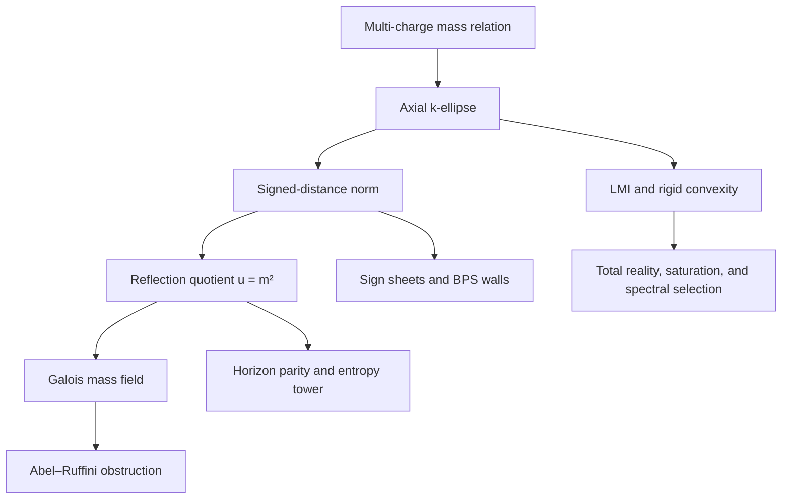
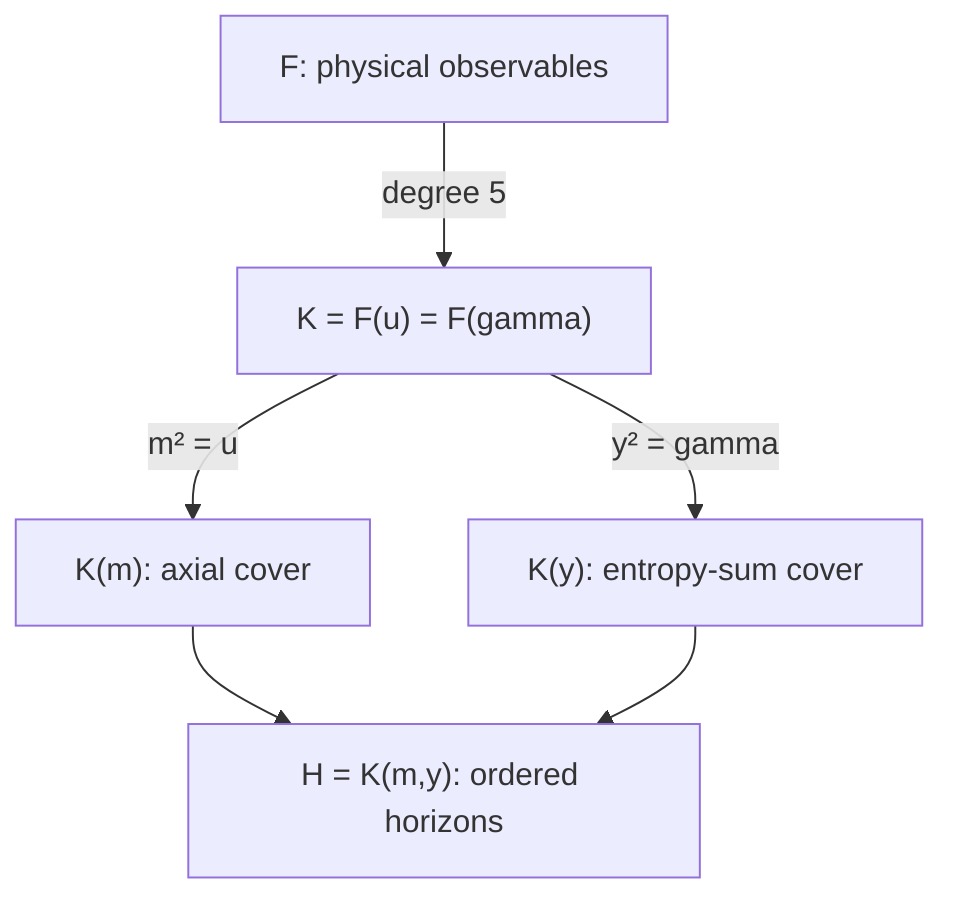
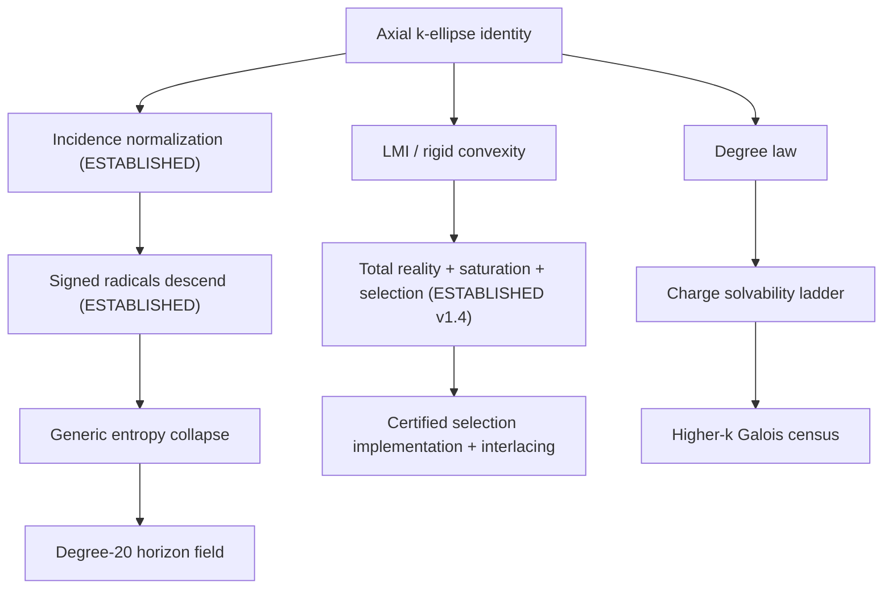

# Galois–k-Ellipse Horizon Program — Research Map

**Version:** v1.4
**Date:** 2026-07-10 (fifth revision of 07-10)
**Purpose:** Maintain the branch structure created by identifying the multi-charge mass fiber with an axial section of an algebraic `k`-ellipse.
**Central physical family:**

```text
4M = sum_{i=1}^k sqrt(m^2 + N_i^2),
N_i = 4Q_i,
u = m^2.
```

## 0. Changelog

### v1.3 → v1.4 (07-10, second GO of the day: R5 package)

All changes derive from **LOG_ENTRY_R5_total_reality_v2.md** (the promoted
entry), **AUDIT_REPORT_R5_TOTAL_REALITY_AND_LEDGER_v0_2.md**, and the
counter-audit folded into the v2 entry. GO given 07-10 after audit +
counter-audit.

1. **R5 promoted to ESTABLISHED**, in strengthened form (package R5a–R5e):
   total reality upgraded to **strict positivity** of every mass-square
   root; the strict chamber is **exactly** the definiteness region of the
   axial NPS pencil (sign-conjugate convention, orthogonally equivalent).
2. **New results banked with R5** (entry v2 §5): parity-block
   singular-value factorization `N_k(u) = det(L_0)·prod_j(1 - u σ_j(T)^2)`;
   **sheet-saturation theorem** (each positive-imbalance sheet crosses
   exactly once, transversely; no other sheet crosses; chamber multiplicity
   is collision-only — the critical-sheet mechanism is void on the strict
   axial chamber); **physical root = unique least root**; **exact selection
   formula** `u_phys = λ_max(S)^{-2} = ||T||^{-2}` (generalized-eigenvalue /
   Rayleigh / first-spectrahedral-exit form); strict coefficient-sign
   alternation `(-1)^r c_r > 0`; `k = 4` **global** simplicity + canonical
   shadow-root ordering under (H2) alone; physical-root sensitivity
   formulas (condition numbers). New register row **R20**.
3. Audit corrections enacted: NPS attribution (sign-conjugate); Remark D's
   per-point `S_5` claim deleted (Hilbert irreducibility is almost-all —
   new **guardrail 15**); the `(2,1,1,1,1)` witness recast as an **exact
   degeneracy certificate** `N_4 = 2^30(3-u)(15-u)^4` — first explicit
   instance of Branch E's (1,4) stratum; distinct-charge witness replaced
   by `(3,1,2,3,4)`; zero-charge boundary qualification; discriminant
   bookkeeping corrected.
4. **Absorption test (OBJ-004) completed** with a **stronger-absorption**
   verdict: equivariant definite-pencil theory absorbs reality, positivity,
   spectral multiplicity, and the first-exit selection *mechanism*; the
   physical/BPS *interpretation* and its covariant/wall/reconstruction
   coupling are the residue. THM-005 split (005a translated / 005b bridge);
   R5 alone does **not** count toward the ledger's G4-02. MOEL v0.3 carries
   the enactment.
5. Stage 4 items 1–2 **DONE**; item 4 **split**: selection rule PROVED,
   certified implementation OPEN (named Cella consumer). **Stage 1 paper
   freeze UNBLOCKED** (sequencing condition Stage 2 + R5 now satisfied).
6. Guardrails: 13 annotated (strict-axial-chamber refinement); **new 14**
   (strict-chamber/axial scope of total reality) and **new 15** (generic
   group ≠ specialized group).
7. Trunk: new promoted addition (§10). Anchors: Plaumann–Vinzant and
   Castillo–Dietmann added. Internal artifacts updated.

### v1.2 → v1.3 (07-10, post-audit GO)

All changes derive from **AUDIT_REPORT_R6_R7_GENERIC_DESCENT.md**, the
counter-audit of the same date, and the GO that followed. The corresponding
log entry is **LOG_ENTRY_R6_R7_generic_descent_v2.md**.

1. **R6, R7 promoted to ESTABLISHED** on GO. R6 emerges strengthened: `C` is the affine normalization of `X` (smooth + finite-birational proof; the v1-draft's false affine one-liner deleted).
2. Ramification clause corrected (audit §5): `ord_v(u)`-odd criterion; `u = 0` requalified as the **signed axial-contact divisor**, of which only the all-plus physical-chamber component is the static BPS/extremal contact; infinite places unswept. **R18 ESTABLISHED (finite part, corrected form).**
3. Discriminant scope corrected (audit §6): sub-balance varieties give the **sheet-collision** components only; the critical-sheet mechanism `sum_i eps_i/w_i = 0` recorded as a separate source; lc-collapse boundary footnote added. **Isolation upgraded**: the physical sheet is free of BOTH mechanisms (Branch E, R17).
4. Generic degree-20 crown made explicitly **CONDITIONAL** (audit §7): gate = recorded good-specialization statement for point B + independent re-verification of the Entry 4 certificate, or a specialized degree-20 eliminant certificate. Queued as Branch I item (d); Stage 3 item 5. R8 conditional.
5. **New R19 — ESTABLISHED**: ordered-horizon-field proposition `F(Shat_+, Shat_-) = K(m, y)` (audit §8, with π-normalization fix and `beta != 0` discharge); either horizon alone generates the field via the area product `Shat_+ Shat_- = P`. Degree corollary conditional on item 4's gate.
6. Generic all-`k` minimality **ESTABLISHED** (`k = 5`: 16; `k = 6`: 22, generic); guardrail 3 narrowed accordingly.
7. Temperature-parity precise action recorded (audit §9): `tau(T_+) = T_-` (mixed), `Theta = S*T` anti-invariant — feeds Stage 1 item 1.
8. Guardrails: 6 replaced by the specialization-transfer rule; 11 updated; **new 12 and 13** added. Trunk clauses promoted in corrected form (§10).

### v1.1 → v1.2

All changes derive from **LOG_ENTRY_DRAFT_R6_R7_generic_descent.md** (07-10), which supplies complete proofs for R6 and R7, stated k-uniformly. **Nothing in this revision is promoted to ESTABLISHED** — a new status tier **PROOF SUPPLIED** records the actual state (complete proof drafted; verification and sign-off owed). Promotion is a one-flag flip on sign-off, per the log entry's §12 promotion rule.

1. §1: new status tier **PROOF SUPPLIED** inserted between PROOF-READY and ESTABLISHED. *Methodology addition — ratified in use 07-10.*
2. §3.1: generic minimal degrees for `k = 5` (16) and `k = 6` (22) move from PREDICTED to PROOF SUPPLIED (Thm 4b, k-uniform); "important distinction" clause narrowed to specialized charges.
3. §3.1b: leading-coefficient law noted as the unit-leading-coefficient input to the identification theorem.
4. §4: degree ledger annotated — descent component of the degree-20 statement now generic (pending verification); independent generic re-derivations of the degree-5/degree-10 statements recorded alongside the retained point-B certificates.
5. Branch A: immediate theorem target PROOF SUPPLIED (Thm 2v). Branch B: fixed-field theorem PROOF SUPPLIED (Thm 5).
6. Branch C: generic irreducibility of the degree-16/22 norms PROOF SUPPLIED; groups and census unchanged.
7. Branch E: identified as the **effective genericity control** for R6/R7 — failure-locus table added.
8. Branch G: proof-package items 1–2 PROOF SUPPLIED; division-of-labor block for the fully generic degree-20 theorem.
9. Branch H: deck ramification divisor = BPS contact identification added. Branch I: three optional Cella certificates queued.
10. §6: critical path's first three edges proof-supplied; live frontier is R9. §7: Stage 2 complete pending verification; sequencing note added to Stage 1; Stage 4 flagged as next live front.
11. §8: register rows R2, R6, R7, R8, R10, R11 updated; new row R18 (deck ramification = BPS contact).
12. §9: guardrails 3 and 6 narrowed pending verification; new guardrail 11 (PROOF SUPPLIED ≠ ESTABLISHED). §10: proposed trunk clause appended. §11: internal artifacts list added.

## 1. Status vocabulary

| Label | Meaning |
|---|---|
| **IMPORTED** | A theorem already established in the external mathematical or physical literature. |
| **ESTABLISHED** | Proved symbolically or by an exact certificate in the current black-hole program. |
| **PROOF SUPPLIED** [v1.2; ratified in use 07-10] | A complete proof has been drafted and recorded in the log, but not yet verified and signed off. Sits between PROOF-READY and ESTABLISHED. Promotion by verification only. [v1.4: R5 passed through this tier (v1 draft) and was promoted on GO after audit + counter-audit; the tier is again unoccupied but remains in force.] |
| **PROOF-READY** | A precise consequence with a clear proof route; one stated lemma or certificate remains. |
| **PREDICTED** | A sharp, testable mathematical prediction. |
| **EXPLORATORY** | A plausible research connection whose correct formulation is not yet fixed. |

The program should promote claims only in that order. Numerical agreement is evidence, not promotion by enthusiasm. **[v1.2]** PROOF SUPPLIED is not ESTABLISHED: no downstream claim inherits ESTABLISHED status through a PROOF SUPPLIED link until sign-off.

## 2. The bridge in one statement

Let

```text
P = (m,0),
F_i = (0,N_i),
d(P,F_i) = sqrt(m^2 + N_i^2).
```

Then the mass relation is the intersection of the planar `k`-ellipse

```text
E_k(4M)
 = { (x,y) : sum_i sqrt(x^2 + (y-N_i)^2) = 4M }
```

with the physical half-axis

```text
y = 0,
x = m >= 0.
```

The signed-radical norm is the axial restriction of the algebraic `k`-ellipse polynomial:

```text
p_k(x,y)
 = product_{eps in {+1,-1}^k}
   [4M - sum_i eps_i sqrt(x^2 + (y-N_i)^2)],

p_k(m,0) = N_k(m^2).
```

This single identification links black-hole thermodynamics to multifocal geometry, convex algebraic geometry, symmetric determinantal representations, hyperbolic polynomials, invariant theory, Galois theory, wall arrangements, and exact certified computation.

**[v1.3]** The descent pathway through this identification is **ESTABLISHED** end-to-end (entry v2: Lemma 0 → Lemma 1 → Thm 2 → Lemma 3 → Thm 4 → Thm 5; audited and counter-audited 07-10, promoted on GO), stated for general `k` under the standing hypotheses `N_i != 0`, `N_i^2 != N_j^2`.

**[v1.4]** The convex/LMI pathway is now also **ESTABLISHED** end-to-end
through selection (entry R5 v2: Lemma A → Lemma B → R5a → R5b → R5c → R5d →
R5e; audited, counter-audited, promoted on GO 07-10): the strict physical
chamber is exactly the definiteness region of the axial pencil; the mass
fiber is totally real and strictly positive; and the physical root carries
an exact spectral selection formula. Only the certified numerical
implementation and interlacing remain on this path.



## 3. The immutable trunk

### 3.1 Degree law

Nie–Parrilo–Sturmfels prove that the algebraic `k`-ellipse has planar degree

```text
D_k = 2^k                              if k is odd,
D_k = 2^k - binom(k,k/2)               if k is even.
```

Because the physical axis restriction is even in `m`, the signed mass norm has

```text
deg_u N_k
 = 2^(k-1)                             if k is odd,
 = 2^(k-1) - (1/2)binom(k,k/2)         if k is even.
```

The direct axial proof pairs `eps` with `-eps`. Writing

```text
s_eps = sum_i eps_i,
```

each unbalanced sign-pair contributes one power of `u`; each balanced pair with `s_eps=0` contributes none. **[v1.4]** Both counts now carry an independent pencil re-derivation: `deg_m Phi_k = rank Z = D_k` and `deg_u N_k = rank C = D_k/2` (entry R5 v2, R5a/R5b) — consistency cross-checks, flagged as such.

| `k` | Planar/`m` degree `D_k` | `u=m^2` norm degree | Status |
|---:|---:|---:|---|
| 1 | 2 | 1 | **IMPORTED + ESTABLISHED** |
| 2 | 2 | 1 | **IMPORTED + ESTABLISHED** |
| 3 | 8 | 4 | **IMPORTED + ESTABLISHED** |
| 4 | 10 | 5 | **IMPORTED + ESTABLISHED** |
| 5 | 32 | 16 | **ESTABLISHED norm degree** (pairing theorem + constructor run 07-10); generic minimal/physical degree **ESTABLISHED [v1.3, GO 07-10]** (Thm 4b, k-uniform); specialized instances OPEN |
| 6 | 44 | 22 | **ESTABLISHED norm degree** (pairing theorem, general proof); generic minimal/physical degree **ESTABLISHED [v1.3, GO 07-10]** (Thm 4b); specialized instances OPEN |

Important distinction:

```text
deg N_k(u) = delta_k
```

is a theorem about the signed norm. The physical seed has minimal degree `delta_k` only after irreducibility is proved for the axial specialization.

**[v1.3]** Generic irreducibility of the axial specialization is **ESTABLISHED** for **every** `k` with distinct nonzero `N_i^2` (entry v2, Thm 4b: `Phi_k` irreducible over `F` via the field isomorphism, hence `N_k` irreducible over `F`; audited, promoted on GO). The distinction above survives only for **specialized** charge vectors, which still require Hilbert/witness arguments (Branch I).

### 3.1b Leading-coefficient law **[ESTABLISHED 07-10; was missing from v1.0]**

With `b_k = (1/2)binom(k,k/2)` balanced pairs (even `k`; zero for odd):

```text
lc(N_k) = (-1)^(2^(k-1) - b_k) * (16 M^2)^(b_k) * product_{s_eps > 0} s_eps^2.
```

Odd `k`: sign `+`, `M`-free, and a PERFECT SQUARE of the hyperoctahedral product
`prod_{s_eps>0} s_eps` (k=3: lc = 9; k=5: lc = 1215^2 = 1476225 — both certified
with symbolic `M`). Even `k`: reproduces the certified `k=4` value `-2^24 M^6`
(the `M`-weight of the leading coefficient lives entirely in the balanced
(k/2,k/2) pair-decay classes).

**[v1.2]** This law now does double duty: the nonvanishing of `lc(N_k)` is the
unit-leading-coefficient input to the identification theorem (R6/R7 entry,
Thm 4 — finiteness of `F[m]/(Phi_k)` over `F`).

**[v1.4]** Triple duty: on the strict chamber the alternation law
`(-1)^r c_r > 0` (entry R5 v2, R5b) reproduces the lc sign — `k = 4`:
`n = 5` gives `c_5 < 0`, matching `-2^24 M^6`. Alternation is a free exact
falsification gate for every symbolic expansion of `N_k` (Cella harness
item; Branch I).

**Corollary (odd-`k` wall identity, certified at k=5):**

```text
prod(branches) = 4^(2k) * product_{2^k walls} (M ± Q_1 ± ... ± Q_k) / lc,
```

with a CONSTANT denominator at odd `k` (k=5: 1215^2), versus `M^6` at `k=4`.
Note for Branch D: the odd-`k` positive-perfect-square normalization is
determinantal-friendly; parity of the focus count should appear structurally
in the NPS pencil.

### 3.2 Four-charge Galois core

For `k=4`:

```text
F = Q(M,Q_1,Q_2,Q_3,Q_4),
K = F(u),
[K:F] = 5,
Gal(K^gal/F) = S_5.
```

Consequences already certified:

```text
u = m^2 is not expressible in radicals over F;
the generic four-charge boost parametrization is radical-one-way;
the static squared entropy sum generates the same quintic field;
the entropy sum and the individual horizons are not radical functions of F.
```

The new geometric interpretation is:

```text
The first nonsolvable black-hole mass inversion is the reflection quotient
of the first axial k-ellipse whose quotient degree exceeds four.
```

**[v1.3]** The reflection-quotient reading is **ESTABLISHED**: `W^tau = K`
(entry v2, Thm 5), with the deck transformation's finite fixed divisor equal
to the **signed axial-contact divisor** `u = 0`, whose all-plus physical
component is the static BPS/extremal contact locus (corrected remark; R18).
The degree statements `[K:F] = 5`, `[K(m):F] = 10` carry an independent
generic re-derivation via `Phi_4` (Thm 4a–b); point-B certificates retained
as cross-checks.

**[v1.4]** On the strict chamber the quintic's five roots are real, strictly
positive, and (under (H2) alone) **globally simple**, with the four shadow
roots strictly ordered by charge magnitude and `u_phys` the unique least
root (entry R5 v2, R5b–R5d). Per-point arithmetic (`S_5`, irreducibility at
rational specializations) still requires certification — guardrail 15.

## 4. Canonical cover tower

Define in the static four-charge case:

```text
w_i^2 = u + N_i^2,
sum_i w_i = 4M,
P = product_i N_i,

alpha = e_4(w) + u e_2(w) + u^2,
beta  = e_3(w) + u e_1(w),

A = alpha + m beta = product_i(w_i+m),
B = alpha - m beta = product_i(w_i-m),
AB = P^2.
```

Normalize the entropy variables by

```text
y = (S_+ + S_-)/pi,
z = (S_+ - S_-)/pi.
```

Then

```text
y^2 = 2(alpha+P) =: gamma,
z^2 = 2(alpha-P),
y*z = 2m beta,

S_+/pi = (y+z)/2,
S_-/pi = (y-z)/2.
```

The field architecture is therefore:



Current degree ledger:

| Field/object | Degree over `F` | Status |
|---|---:|---|
| `K=F(u)=F(gamma)` | 5 | **ESTABLISHED**; [v1.3] independent generic re-derivation via `Phi_4` irreducibility (Thm 4b) **ESTABLISHED**; point-B route retained |
| `K(m)` | 10 | **ESTABLISHED 07-10**: `E_u = Res(N, Y^2-u)` irreducible deg 10 at B; plus prose proof (wall norm has 16 distinct linear factors at odd exponent, `256/M^6` a square); [v1.3] generic proof via `F[m]/(Phi_4) ≅ W` (Thm 4) **ESTABLISHED**; both routes retained |
| `K(y)` | 10 | **ESTABLISHED by irreducible degree-10 entropy-sum polynomial**; [v1.3] generic definedness of `gamma ∈ K` **ESTABLISHED** (C2 unconditional part) |
| `K(m,y)` | 20 | **ESTABLISHED at B**: `E_{u*gamma}` irreducible deg 10 at B ⇒ `[u],[gamma]` independent in `K*/K*^2` ⇒ `Gal(K(m,y)/K) = V_4`; [v1.3] descent component (`w_i ∈ K`) generic, **ESTABLISHED**; the **generic transfer of the V_4/degree-20 statement is CONDITIONAL** pending the good-specialization statement for B + independent re-verification of the Entry 4 certificate (Branch I item d) — see Branch G division of labor. [v1.3, R19] On closure of that gate, `K(m,y) = F(Shat_+, Shat_-)` is THE ordered-horizon field, generated by either horizon entropy alone |

The decisive degree-20 test — `u*gamma` not a square in `K` — **was run and
passed on 2026-07-10** (RESEARCH_LOG Entry 4): `u`, `gamma`, `u*gamma` all
non-squares at point B, hence `[u]` and `[gamma]` independent in `K^*/K^{*2}`,
hence:

```text
[K(m,y):K] = 4,
[K(m,y):F] = 20,
Gal(K(m,y)/K) = V_4        [ESTABLISHED at B; generic by specialization].
```

**[v1.3 narrowing, per audit §7.]** The "generic by specialization" tag is
valid only through **eliminant irreducibility** with a recorded
good-specialization statement (B separable, leading coefficients nonzero,
`u, gamma, u*gamma` regular and nonzero at B, denominator/ramification loci
avoided). Recording that statement and independently re-verifying the
certificate is queued as Branch I item (d) / Stage 3 item 5. The at-B
certification itself is unaffected. **[v1.4] Untouched by the R5 entry:
item (d) remains REQUIRED and is unaffected by anything promoted today.**

**Still open (do not conflate):** the Galois group of the CLOSURE of `K(m,y)`
over `F` — the full monodromy of the ordered-horizon cover (a subgroup of a
degree-20-compatible extension of `S_5` by 2-groups). That is register R9.

## 5. Branch map

### Branch A — Multifocal algebraic geometry

**Imported mathematics**

```text
k-ellipse degree theorem;
signed-distance defining polynomial;
symmetric determinantal representation;
normalization and algebraic sign sheets;
singularities and projective closure.
```

**Black-hole translation**

```text
foci       <-> charge channels N_i,
radius     <-> total mass 4M,
axis point <-> seed mass m,
reflection <-> m -> -m,
axis norm  <-> mass eliminant.
```

**Immediate theorem target**

```text
Prove that the signed-distance incidence curve is birational to the
normalization of the axial k-ellipse for generic independent charges.
```

**[v1.3] ESTABLISHED — strengthened.** Entry v2, Thm 2(v): `phi : C -> X`
is birational, and under (H1)/(H2) `C` is smooth, hence normal, hence **the
affine normalization of `X`** (smooth + finite-birational proof; the v1
draft's false affine one-liner deleted, counterexample `A^1` vs
`A^1 \ {0}`). Still not claimed: projective closure, singularity
classification of `X`, regular compactified models (Branch H / Jiang–Han).

**Payoff:** supplies the generic function-field home for every signed radical `w_i`. **[v1.3]** Delivered by Thm 4(c): `w_i ∈ F(m)` — ESTABLISHED.

---

### Branch B — Reflection invariant theory

The axial involution is

```text
tau(m) = -m,
tau(u) = u,
tau(w_i) = w_i.
```

The quotient is

```text
F(m) / <tau> = F(m^2) = F(u).
```

For static entropy:

```text
tau(A) = B,
tau(B) = A,
tau(S_+) = S_-,
tau(S_-) = S_+.
```

**Core new statement:** the horizon deck transformation is the axial reflection of the multifocal mass geometry. **[v1.3] ESTABLISHED** (Thm 5: existence of `tau` on `W`, `W^tau = K`; promoted on GO).

**[v1.4] Matricial avatar — ESTABLISHED (entry R5 v2, Remark A / R5b):**
`tau` acts on the axial NPS pencil as conjugation by the total spin flip
`X_all = σ_x^{⊗k}`; the pencil's `Ad(X_all)`-even part is `L_0` and its odd
part is `m·Z`. The invariant/anti-invariant split of this branch is the
parity grading of the spectral problem, and the mass fiber is the
singular-value spectrum of the odd block in the even metric.

**Next results**

1. Formalize the fixed-field theorem. **[v1.3] ESTABLISHED** (Thm 5).
2. Determine the complete involution group on `K(m,y)`. **OPEN** (R9-adjacent).
3. Separate horizon swap, simultaneous entropy-sign reversal, and charge-sign actions. **OPEN**; [v1.4] the matricial avatar supplies the concrete arena (spin-flip vs slot-wise sign actions on the pencil).

---

### Branch C — Galois and monodromy ladder

Known and predicted sequence:

```text
k=1: rational
k=2: rational
k=3: quartic, solvable
k=4: quintic with generic S_5, nonsolvable
k=5: degree-16 norm, group unknown
k=6: degree-22 norm, group unknown
```

**[v1.3]** The degree-16 and degree-22 norms are generically irreducible
(minimal) — **ESTABLISHED** (C4, k-uniform; GO 07-10). The generic degree-16
and degree-22 fields therefore exist as fields. Groups remain unknown; the
census experiment below is unchanged and still requires specialized
witnesses.

**Do not assume** the higher groups are full symmetric groups. Determine them.

**Research questions**

```text
What is Gal(N_k/F) for generic k?
What subgroup constraints are inherited from signed-distance geometry?
How does monodromy act on sign sheets?
Which charge coincidences reduce the group?
What is the discriminant locus in charge-mass parameter space?
```

**Next decisive experiment:** generate `N_5(u)` at one small rational physical specialization, prove irreducibility, and obtain enough Dedekind cycle types to identify its transitive degree-16 Galois group. **[v1.4]** Any such construction must pass the alternation gate `(-1)^r c_r > 0` on chamber specializations (free falsification check, R5b).

---

### Branch D — Convex algebraic geometry, LMI, and hyperbolicity **[v1.4: proof target DISCHARGED — package ESTABLISHED]**

Nie–Parrilo–Sturmfels provide

```text
p_k(x,y) = det L_k(x,y),

E_k = { (x,y) : L_k(x,y) >= 0 }.
```

The physical mass relation is therefore an axial boundary condition of a spectrahedron. **[v1.4]** The program's working pencil is the **sign-conjugate** of the displayed NPS convention — orthogonally equivalent, same determinant and spectrahedral region (entry R5 v2 §1.1).

**Important scope:** the BPS inequality concerns feasibility of the physical axis section, not non-emptiness of the entire planar `k`-ellipse.

Along the physical axis:

```text
f(m) = sum_i sqrt(m^2+N_i^2),
f(0) = sum_i |N_i|,
f'(m) > 0 for m>0.
```

Hence a physical root exists exactly when

```text
4M >= sum_i |N_i|
```

and is unique for `m>=0`.

**Rigid-convexity consequence:** in the strict chamber

```text
4M > sum_i |N_i|,
```

the origin lies inside the `k`-ellipse and the axis passes through its interior. The determinantal polynomial restricted to that line is real-rooted.

**[v1.4] The proof target of v1.0–v1.3 is ESTABLISHED, strengthened
(entry R5 v2, GO 07-10):**

```text
R5a  Cham = { L_0 ≻ 0 } exactly (chamber = definiteness identity);
     Phi_k real-rooted on the axis; deg = rank Z = D_k; inertia counts
     exactly D_k/2 positive m-roots.
R5b  Parity-block SVD: N_k(u) = det(L_0)·prod_j (1 - u σ_j(T)^2);
     every u-root real and STRICTLY POSITIVE (N_k(0) = det L_0 > 0);
     multiplicity = singular-value multiplicity; strict coefficient
     alternation (-1)^r c_r > 0.
R5c  Sheet saturation (one transverse crossing per positive-imbalance
     sheet; no others; chamber multiplicity is collision-only);
     u_phys is the UNIQUE LEAST root; exact selection formula
     u_phys = λ_max(S)^{-2} = ||T||^{-2}  (Rayleigh / first spectrahedral
     exit along the mass ray); sensitivity formulas
     ∂u_phys/∂M = 8/Σ(1/w_i) > 0,  ∂u_phys/∂N_j = -2N_j/[w_j Σ(1/w_i)].
R5d  k = 4: GLOBAL simplicity of all five roots under (H2) alone;
     shadow roots strictly ordered by charge magnitude.
R5e  Generic simplicity all k (nonzero discriminant polynomial); every
     chamber multiple root is an inter-sheet collision.
```

**Payoff — realized:** total reality is structural hyperbolicity;
interlacing (Stage 4 item 3) and the **certified** eigenvalue selection
(Stage 4 item 4, implementation half) are the open remainder of this
branch. The selection *rule* is closed.

---

### Branch E — Wall arrangements and BPS geometry

At the axial collapse `m=0`:

```text
4M - sum_i eps_i N_i = 0
```

becomes

```text
M - sum_i eps_i Q_i = 0.
```

For four charges:

```text
Norm_{K/F}(u)
 = 256/M^6
   product_{eps in {+1,-1}^4}
   (M + eps_1 Q_1 + eps_2 Q_2 + eps_3 Q_3 + eps_4 Q_4).
```

**Interpretation**

```text
signed focal sheets -> signed BPS walls,
physical sign chamber -> physical BPS inequality,
wall union -> zero locus of the Galois norm,
wall intersections -> higher degeneracy strata.
```

**Research directions**

1. Identify the wall arrangement as a signed hyperplane arrangement and compute its intersection lattice.
2. Relate discriminant multiplicities to wall intersections.
3. Determine whether lower quintic coefficients encode lower-dimensional wall strata.
4. Study charge permutations and sign changes as an action of the hyperoctahedral group.
5. Compare these walls with genuine marginal-stability walls in the underlying supergravity/string compactification.

The fifth item requires physics-specific care: algebraic wall factors and physical decay walls need not coincide automatically.

**Missing from v1.0 — two results already in hand (07-10):**

*Physical-sheet isolation theorem* **[ESTABLISHED, prose proof; write-up owed]**:
two sign branches `eps, eps'` share a root only where
`sum_i (eps_i - eps'_i) w_i = 0`; against the all-plus branch this is a sum of
strictly positive `w_i` — never zero. The physical sheet participates in NO
collision, for every `k`, everywhere on the real domain. Collisions are
confined to the shadow sector.

*Collision classification + certified strata* **[strata ESTABLISHED by run;
v1.3 SCOPE CORRECTION per audit §6]**: the **sheet-collision components** of
the discriminant are the signed sub-balance varieties
`sum_{i in D} sigma_i w_i = 0` — they are one of two mechanisms, not the
whole of `Disc_u N_k` (see the v1.3 block below). Among the real sheets of the physical chamber
these reduce to focal coincidences `N_i^2 = N_j^2`; certified factorizations:
all-equal charges ⇒ `(simple physical)(quadruple shadow)` — pattern (1,4);
one pair equal ⇒ multiplicities (1,2)+(irreducible cubic). Complex sub-balance
loci (e.g. `w_1 = w_2 + w_3`) exist off the real chamber and are the braid
generators for the monodromy campaign (R9/Q1). Degeneration lattice = partition
lattice of the focus set, with the physical sheet always outside it.

**[v1.4] Exact (1,4) certificate banked.** At `(M,N) = (2,1,1,1,1)`
(strict chamber; (H2) maximally violated):

```text
N_4(u) = 2^30 · (3 - u) · (15 - u)^4,     u_phys = 3,   u_shadow = 15 (×4)
```

— independently re-verified in the R5 counter-audit. First fully explicit
instance of the all-equal stratum; also the live demonstration of R5d's
contrapositive (four (H2)-violations ⇒ fourfold shadow collision).

**New in v1.2 — Branch E is the effective genericity control for R6/R7:**

The sub-balance varieties are exactly the exceptional locus of the birational
map `phi : C -> X` (R6/R7 entry, Thm 2(v)), and the hypotheses of the descent
package degenerate precisely on the strata this branch has already classified.
Physical-sheet isolation says the physical branch **never enters** the
degeneration locus over the real chamber.

| Ingredient (R6/R7 entry) | Fails exactly on | Branch E/H object | Reading |
|---|---|---|---|
| (H1): `d_i` squarefree | `N_i = 0` | degenerate channel | `k -> k-1` reduction; crossing `k = 4 -> 3` is the solvability threshold |
| (H2): `d_i` pairwise coprime | `N_i^2 = N_j^2` | focal coincidence — locus 4; certified strata (1,4) [v1.4: exact instance banked], (1,2)+cubic | group reduction under charge coincidence |
| Lemma 1 under specialization | `sum_{i in D} sigma_i w_i = 0` | sub-balance varieties = **sheet-collision components** of `Disc_u N_k` [v1.3] | branch collisions; physical branch always outside (isolation theorem) |
| `m = 0` fiber | not a failure | finite ramification divisor of `W/K` — the signed axial-contact divisor (Thm 5 remark, corrected) | all-plus component = static BPS/extremal contact |

**[v1.3] Discriminant mechanisms (audit §6).** Two sources of
`Disc_u N_k` vanishing, not one:

```text
1. Sheet collision:  s_eps = s_eps'   <=>  a signed sub-balance vanishes;
2. Critical sheet:   d/du [4M - s_eps(u)] = 0   <=>   sum_i eps_i / w_i = 0
                     — a double root WITHIN one signed sheet.
```

The certified strata above remain valid as computed instances of mechanism 1.
Critical-sheet components require their own stratification (feeds R12).
*Boundary footnote:* at even `k` the leading coefficient carries `M`-weight
(`-2^24 M^6` at `k = 4`); on `M = 0` the `u`-degree drops and discriminant
bookkeeping changes — boundary-grade, off-chamber, not a component claim.

**[v1.3] Isolation upgrade — ESTABLISHED (prose).** On the real physical
chamber the all-plus sheet has `sum_i 1/w_i > 0` strictly, so the physical
sheet contains **no critical point**. Combined with the collision-free
theorem above, the physical sheet is free of **both** discriminant
mechanisms. Folds into the R17 write-up.

**[v1.4] Saturation upgrade — ESTABLISHED (entry R5 v2, R5c-0).** On the
**strict axial chamber**, tangency-freeness extends from the physical sheet
to **every crossing sheet**: each positive-imbalance sheet crosses exactly
once and transversely; zero/negative-imbalance sheets never cross. Hence
**every chamber multiple root is an inter-sheet collision** (mechanism 1);
mechanism 2 produces no axial discriminant point inside the strict chamber.
The two-mechanism decomposition remains correct for the broader discriminant
geometry (complex domain, off-chamber, planar); see guardrail 13's
annotation. This sharpens the R12 stratification target: on the strict
axial slice, only collision strata exist.

---

### Branch F — Thermodynamic parity and covariants

For Kerr–Newman, temperature is not a pure odd representation. The correct odd covariant is

```text
Theta := S*T,

Theta_+ =  sqrt(Delta)/(2M),
Theta_- = -sqrt(Delta)/(2M).
```

Thus

```text
sigma(Theta) = -Theta,
Theta^2 = Delta/(4M^2).
```

Temperature decomposes into even and odd parts:

```text
T_even = (T_+ + T_-)/2,
T_odd  = (T_+ - T_-)/2.
```

**New organizing principle**

```text
Horizon-even objects descend through the reflection quotient.
Horizon-odd objects are covariants of the axial reflection.
Mixed thermodynamic quantities are ratios or combinations of the two.
```

**[v1.3] Precise deck action on the entropy fields (audit §9; feeds Stage 1
item 1):**

```text
tau(m) = -m,   tau(y) = y,   tau(z) = -z,
tau(Shat_+) = Shat_-,        tau(Shat_-) = Shat_+,
tau(T_+) = T_-               (temperature is MIXED, not anti-invariant),
tau(Theta) = -Theta,         Theta = S*T   (the pure odd covariant).
```

The horizon-cover paper must say `tau(T_+) = T_-`, never `tau(T_+) = -T_+`.

**[v1.4]** The deck action now has a matrix model: `tau = Ad(X_all)` on the
axial pencil, with `L_0` even and `m·Z` odd (Branch B avatar). Target 3
below gains a concrete computation arena.

**Next targets**

1. Express the four-charge static `S*T` directly in `m,w_i` and prove its reflection parity.
2. Derive the sector first laws from the even/odd function-field decomposition.
3. Classify thermodynamic observables by invariant, anti-invariant, or mixed parity.
4. Reassess the charge-parity principle using focus-label representations.

---

### Branch G — Generic entropy descent and the full horizon field

The present pointwise certificates suggest

```text
w_i = g_i(u) in K = F[u]/(N_4).
```

The k-ellipse supplies the conceptual generic proof route:

```text
signed distances live on the normalized axis cover
    -> w_i in F(m)
    -> w_i fixed by m -> -m
    -> w_i in F(m)^tau = F(m^2) = K.
```

**[v1.2]** This route is no longer conceptual — it is the proved route
(Thm 2 → Thm 4 → Thm 5), with the middle step carried by the identification
`F[m]/(Phi_4) ≅ W` rather than assumed.

Then

```text
alpha,beta,gamma in K,
alpha^2 - u beta^2 = P^2,
y^2 = gamma,
z = 2m beta/y.
```

**Required proof package (statuses updated 07-10; [v1.2] revisions marked)**

1. Birational incidence/normalization lemma — **ESTABLISHED [v1.3]** (Thm 2 v2, strengthened: `C` = affine normalization of `X`; was OPEN, critical path).
2. Generic fixed-field descent `w_i in K` — **ESTABLISHED [v1.3]** (Thm 5; was OPEN).
3. Primitive-element proof `K=F(gamma)` — **DONE** (resolvent irreducible,
   S_5 witnesses p=17,19,23; generic by specialization).
4. Square-class independence of `u` and `gamma` — **DONE** (Entry 4:
   `E_u`, `E_{u*gamma}` both irreducible degree 10).
5. Exact degree and Galois/monodromy group of the ordered entropy cover —
   degree **DONE** (20, `V_4` over `K`); closure group over `F` **OPEN** (R9).

**The theorem (division of labor, v1.3):**

```text
The static ordered-horizon field is a degree-20 biquadratic lift
of a non-Galois quintic whose Galois closure is S_5.
```

```text
entry v2   :  w_i ∈ K generically; tower generically defined    [ESTABLISHED]
Entry 4    :  [u],[gamma] independent in K*/K*^2 at B           [ESTABLISHED at B]
              generic transfer via eliminant irreducibility      [CONDITIONAL —
              good-specialization statement + independent
              re-verification queued: Branch I (d)]
witnesses  :  Gal(K^gal/F) = S_5 (p = 17,19,23)                  [ESTABLISHED]
R19        :  K(m,y) = F(Shat_+, Shat_-) — the ordered-horizon
              field; either horizon generates it alone via
              Shat_+ Shat_- = P                                  [ESTABLISHED;
              degree corollary conditional on the gate]
open       :  closure group of K(m,y) over F                     [R9]
```

The descent carries no pointwise caveat. The **generic degree-20 crown**
releases when Branch I item (d) closes; until then it is CONDITIONAL
(guardrail 11).

---

### Branch H — Singularities, discriminants, and ramification

There are now several degeneracy loci — **with two identifications the v1.0
list missed (AUDIT CORRECTION 07-10):**

```text
1. BPS/axis contact:            m = 0;
2. horizon extremality:         S_+ = S_-;
3. mass-fiber discriminant:     Disc_u N_k = 0;
4. coincident foci:             N_i^2 = N_j^2;
5. entropy square branching:    gamma = 0;
6. ordered-horizon branching:   gamma - 4P = 0.
```

**Corrections (proven):**
- Locus 6 IS locus 2, identically: `z^2 = 2(alpha - P) = gamma - 4P`, so
  `gamma - 4P = 0  <=>  z = 0  <=>  S_+ = S_-`. Not two loci.
- STATICALLY, locus 2 (= 6) coincides with locus 1: `A, B > 0` on the physical
  branch and AM–GM gives `2 alpha = A + B >= 2 sqrt(AB) = 2P`, i.e.
  `alpha >= P`, with equality iff `A = B` iff `m*beta = 0` iff `m = 0`
  (since `beta = e_3(w) + 4Mu > 0`). Static extremality = BPS contact.
  The loci separate only once rotation enters (extremality at `a -> m`, `m != 0`).

**[v1.4] Locus-3 refinement on the strict axial chamber:** by saturation
(Branch E, R5c-0), locus 3 meets the strict axial chamber only through
**mechanism-1 collisions** among positive-imbalance sheets; on `k = 4` those
reduce, under (H2)-failure, to the certified focal-coincidence strata —
locus 3 ∩ strict axial chamber ⊆ locus 4's shadow sector. Critical-sheet
components of locus 3 live off the strict axial slice (complex domain,
off-chamber, or planar directions) and remain R12 targets there.

**Program:** classify inertia at each locus; connect to Jiang–Han
singularity results for the planar curve; determine which loci are visible
in the LMI pencil as rank drops. **[v1.4]** Rank-drop dictionary started:
locus 3 on the axis = repeated singular value of `T`; boundary of `Cham` =
`λ_min(L_0) = 0`; `m = 0` fiber = the even/odd block split itself.

---

### Branch I — Arithmetic and exact certification

The physical chamber produces totally real specializations of a nonsolvable
generic field. **[v1.4, corrected wording per audit R2:]** every
strict-chamber specialization of `N_4` has five positive real roots counted
with multiplicity (R5b); at any rational or algebraic chamber
specialization for which `N_4` is **additionally certified** irreducible
with Galois group `S_5`, the resulting quintic field is totally real.
Generic `S_5` does not transfer pointwise (Hilbert irreducibility is
almost-all; guardrail 15). This opens:

```text
totally real S_5 quintic arithmetic (per certified specialization);
field discriminants and ramified primes;
integral models under quantized charges;
Chebotarev/Dedekind certification;
Hilbert irreducibility across physical parameter regions;
certified root isolation and chamber tracking.
```

**Cella role**

```text
exact norm construction;
exact polynomial reduction;
Dedekind factorization witnesses;
independent interval isolation of physical roots;
certificate-producing LMI positivity tests;
exact square-class and resultant checks;
[v1.4] certified extremal generalized-eigenvalue selection
       (Z v = λ L_0 v; u_phys = λ^{-2} with rational interval enclosure)
       — THE named consumer for Stage 4 item 4;
[v1.4] alternation gate (-1)^r c_r > 0 as a free falsification check in
       the constructor harness.
```

This is a direct application of Cella's intended identity: court, not calculator.

**[v1.3] Queued certificates (entry v2 §12; item d is the GATE) — [v1.4]
item (d) untouched and still REQUIRED; items updated:**

```text
a. gcd( Phi_4, dPhi_4/dM ) = 1 over F0(m), symbolic
   — generic branch distinctness (Thm 2(i) shadow);                [optional]
b. point B: certified pairwise distinctness of the 16 branch values
   by interval isolation (Lemma 1 shadow under specialization);    [optional]
c. k = 5 cross-check: leading m-coefficient of Phi_5 against §3.1b
   (odd-k perfect square, 1215^2 pattern);                         [optional]
d. GATE: record the good-specialization statement for point B
   (separability; nonzero leading coefficients; u, gamma, u*gamma
   regular and nonzero; denominator/ramification loci avoided) and
   independently re-verify the Entry 4 certificate (E_u, E_{u*gamma})
   — OR supply one irreducibility certificate for a specialized
   degree-20 eliminant. Closing (d) releases the generic degree-20
   crown (R8) and [F(Shat_+):F] = 20 (R19 corollary).              [REQUIRED]
e. [v1.4] certified extremal generalized eigenvalue at a rational
   chamber point, returning an interval enclosure of u_phys
   (Stage 4 item 4 implementation; CCAF-adjacent consumer);        [queued]
f. [v1.4] exact Sturm/interval isolation at (3,1,2,3,4): five simple
   positive roots (replaces the invalid all-equal witness);        [queued]
g. [v1.4] BANKED: exact factorization N_4 = 2^30(3-u)(15-u)^4 at
   (2,1,1,1,1) — the (1,4) degeneracy certificate.                 [banked]
```

---

### Branch J — Generalized multifocal black-hole families

The external theory already extends to weighted `k`-ellipses and higher-dimensional `k`-ellipsoids.

Potential translations:

```text
weighted distances    <-> unequal charge couplings or scalar dressings;
higher-dimensional foci <-> several seed/modulus variables;
moving foci           <-> moduli-dependent dressed charges;
indefinite forms      <-> rotation or Lorentzian/pseudo-Euclidean extensions;
different radius law <-> gauged or cosmological-constant deformations.
```

**Guardrail:** these are analogies until a specific black-hole elimination relation is derived in the corresponding form.

Best targets:

1. Static STU subfamilies with nontrivial scalar moduli.
2. Five-dimensional three-charge black holes.
3. Rotating four-charge entropy cover over the same mass fiber.
4. Gauged/AdS families, testing whether the multifocal structure survives or deforms.
5. Weighted charge channels arising from nonuniform normalization.

---

### Branch K — Connection to DBP role geometry

This bridge touches the existing DBP program at several structural points, but no equivalence should yet be claimed.

| DBP structure | Multifocal/Galois analogue | Status |
|---|---|---|
| Role-labelled channels | Focus-labelled charge distances | **STRUCTURAL LINK** |
| Passive `S_k` relabelling | Permutation of foci/charges | **EXACT SYMMETRY** |
| Active role recharting | Solving/eliminating through a chosen charge/focus branch | **EXPLORATORY** |
| Sign/gauge transport | Signed-distance sheet changes | **EXPLORATORY** |
| Collapsing divisors | BPS, discriminant, and entropy branch divisors | **DIRECT TEST TARGET** |
| Inverse-channel local curvature | Local geometry near wall/discriminant strata | **EXPLORATORY** |
| Canonical invariant reduction | Passage to symmetric functions and reflection quotient | **STRONG STRUCTURAL LINK** |

**Most productive DBP test:** apply the local curvature calculus to the discriminant and BPS-wall arrangement of the mass/entropy cover, with each charge treated as an active role channel. Determine whether DBP curvature carriers distinguish ramification types or wall-intersection strata. **[v1.4]** The saturation theorem constrains the test on the strict axial slice: only collision strata exist there, so any curvature signature of critical-sheet type must be sought off-chamber or in planar directions.

## 6. Dependency map



The critical path is:

```text
incidence normalization
    -> generic radical descent
    -> exact field tower
    -> full horizon-cover group.
```

**[v1.3]** The first two edges of the critical path are **ESTABLISHED**
(entry v2), and the exact field tower is generically defined; its degree-20
crown carries one gate (Branch I item d). The path's live frontier is the
closure-group computation (R9), to be run over the **generic** tower — not
over a specialization. Input list for R9 now includes both discriminant
mechanisms: complex sub-balance loci (braid generators) and critical-sheet
strata. **[v1.4]** Saturation localizes the R9 inputs: on the strict axial
chamber only collision monodromy is available; critical-sheet inertia must
be probed off-chamber or in the complex domain.

The independent high-value path is:

```text
LMI / rigid convexity
    -> total reality theorem                    [ESTABLISHED v1.4]
    -> saturation + spectral selection          [ESTABLISHED v1.4]
    -> interlacing and CERTIFIED physical-root
       selection implementation                 [OPEN — the live frontier
                                                 of this path].
```

## 7. Priority campaign sequence

### Stage 1 — Freeze the corrected core **[v1.4: UNBLOCKED — sequencing condition (Stage 2 + R5) satisfied on GO 07-10]**

1. Replace “temperature is Galois-odd” with the `S*T` odd-covariant theorem. **[v1.3 precise action, audit §9:** the paper must state `tau(T_+) = T_-` — temperature is MIXED under the horizon swap; `Theta = S*T` is the anti-invariant.**]**
2. Insert the axial `4`-ellipse identification and the imported degree theorem.
3. Separate degrees `5`, `10`, and `<=20` throughout the paper.
4. State the entropy result as static until rotation is certified.
5. **[v1.4]** Adopt the R5 paper structure (entry v2 §5 / audit §7): R5a
   definite-pencil; R5b equivariant spectral quotient; R5c saturation +
   selection; R5d four-channel global simplicity; R5e generic collision
   locus — with the absorption boundary stated (R5a/most of R5b are
   translated mathematics; R5c/R5d are the realization-specific synthesis).
6. **[v1.4]** Include: chamber = definiteness identity; `u_phys = ||T||^{-2}`
   selection formula; alternation law; sensitivity formulas; the exact
   (1,4) degeneracy certificate; corrected arithmetic wording (guardrail 15).

**[v1.2 sequencing note — DISCHARGED v1.4]** The condition "run Stage 1
after Stage 2 verification and the R5 proof" is now satisfied; the freeze
may proceed. Items 3–4 now read post-verification, as intended.

### Stage 2 — Prove the geometric descent **[COMPLETE — ESTABLISHED on GO 07-10 (v1.3)]**

1. Define the signed-distance incidence curve. — **ESTABLISHED** (entry v2 §1 setup: `C`, `W`, hypotheses (H1)/(H2)).
2. Prove birationality to the normalized axial curve. — **ESTABLISHED, strengthened** (Thm 2(v) v2: `C` is the affine normalization of `X`).
3. Prove `w_i in K` by reflection-fixed descent. — **ESTABLISHED** (Thm 5).
4. Replace the point-B radical-collapse lemma with the generic theorem. — **ESTABLISHED** (C1; C2 unconditional part).

### Stage 3 — Close the full static horizon cover **[COMPLETE 07-10, except items 4b and 5]**

1. Prove `u` nonsquare in `K` — **DONE** (wall-norm odd-exponent prose proof
   + exact certificate `E_u` irreducible).
2. Retain the degree-10 proof that `gamma` is nonsquare — **RETAINED**.
3. Test and prove `u*gamma` nonsquare — **DONE** (`E_{u*gamma}` irreducible).
4. Establish degree `20` — **DONE** (`V_4` lift certified); identify the
   complete Galois/monodromy group of the closure — **OPEN → R9**.
5. **[v1.3]** Record the good-specialization statement for point B and
   independently re-verify the Entry 4 square-class certificate (or supply a
   specialized degree-20 eliminant certificate) — **QUEUED** (Branch I item
   d). Gates the generic degree-20 crown (R8) and the R19 degree corollary.
   **[v1.4] Untouched by the R5 entry; still the gate.**

### Stage 4 — Import convex geometry fully **[v1.4: items 1–2 DONE; item 4 SPLIT]**

1. Write the symmetric matrix pencil `L_4` explicitly in black-hole
   variables. — **DONE** (entry R5 v2 §1.1; sign-conjugate NPS convention).
2. Prove axis real-rootedness in the strict physical chamber. — **DONE**
   (R5a; strengthened to strict positivity, R5b).
3. Derive root interlacing under variation of `M` and charges. — **OPEN**;
   the sensitivity formulas (R5c-3) are the banked derivative layer.
4. Build a certified eigenvalue/root-selection algorithm for the physical
   seed. — **SPLIT [v1.4]**: the exact selection **rule is PROVED**
   (`u_phys = λ_max(S)^{-2} = ||T||^{-2}`; Rayleigh; first spectrahedral
   exit — R5c-2). **OPEN**: the formally certified implementation with
   rational interval bounds (Branch I Cella item e — the named consumer).

### Stage 5 — Map the wall and discriminant strata

1. Factor or stratify `Disc_u N_4`. **[v1.4]** On the strict axial chamber,
   only collision strata occur (saturation); critical-sheet stratification
   is an off-chamber/complex-domain task.
2. Compute the intersection lattice of the sixteen signed walls.
3. Determine inertia/monodromy at generic walls and their intersections.
4. Compare algebraic walls with physical marginal-stability conditions.

### Stage 6 — Open the higher-charge census

1. Construct `N_5(u)` without uncontrolled expansion. **[v1.4]** Apply the
   alternation gate on chamber specializations as a free correctness check.
2. Confirm degree `16` and isolate the physical root. **[v1.3]** Generic
   degree-16 minimality **ESTABLISHED** (C4, GO 07-10); **[v1.4]**
   physical-root isolation is now formulaic: `u_phys = λ_max(S)^{-2}` with
   the `k = 5` pencil (`32 × 32`; parity blocks `16 × 16`).
3. Prove one irreducible physical specialization. **[v1.3]** Generic
   irreducibility **ESTABLISHED** (C4); the specialized instance this item
   asks for remains OPEN and is still required for group witnesses.
4. Determine its degree-16 Galois group.
5. Repeat selectively for weighted or higher-dimensional physical families.

## 8. Research-direction register

| ID | Direction | Current status | Next decisive result | Expected value |
|---|---|---|---|---|
| R1 | Axial `k`-ellipse identification | **ESTABLISHED** | Formal proposition and citation | Foundational |
| R2 | General mass-norm degree formula | **IMPORTED + DERIVED AXIALLY**; [v1.3] unbalanced-count degree identity used in Thm 4(a); [v1.4] independent pencil re-derivation (rank Z, rank C) | Write direct sign-pair proof for the paper | High |
| R3 | Generic `S_5` at four charges | **ESTABLISHED** | Publish exact witnesses | Foundational |
| R4 | BPS wall norm | **ESTABLISHED** | Direct symbolic proof in paper | Very high |
| R5 | Total reality in physical chamber | **ESTABLISHED 07-10 [v1.4, GO]** — strengthened package R5a–e: chamber = definiteness; strict positivity; parity-block SVD; saturation; least-root selection; alternation; k=4 global simplicity + ordering; sensitivity | Fold into paper (Stage 1 items 5–6); feed R20 implementation | Very high |
| R6 | Incidence normalization | **ESTABLISHED 07-10 [v1.3, GO]** — strengthened: `C` = affine normalization of `X` (Thm 2 v2) | Fold into paper | Critical |
| R7 | Generic radical descent `w_i in K` | **ESTABLISHED 07-10 [v1.3, GO]** (Thm 5) | Fold into paper | Critical |
| R8 | Degree-20 ordered horizon field | **ESTABLISHED at B**; descent component **ESTABLISHED [v1.3]**; generic crown **CONDITIONAL** (gate: Branch I d) | Close Branch I (d) | Very high |
| R16 | Leading-coefficient law (all `k`; odd-`k` square; odd-`k` wall identity) | **ESTABLISHED**; [v1.4] alternation cross-check banked | Fold into paper App. B | High |
| R17 | Physical-sheet isolation + collision classification (sub-balance loci) | **ESTABLISHED (prose)**; [v1.3] isolation upgraded — physical sheet free of BOTH mechanisms; [v1.4] saturation extends tangency-freeness to EVERY crossing sheet on the strict axial chamber; exact (1,4) certificate banked | Formal write-up (both mechanisms + saturation); feeds R9/R12 | Very high |
| R18 | Deck ramification: fixed divisor = signed axial-contact divisor; all-plus component = BPS/extremal | **ESTABLISHED (finite part, corrected) [v1.3, GO]** | Infinite-place valuation sweep; fold clause into §10 and paper | Trunk-strengthening |
| R19 | Ordered-horizon field: `K(m,y) = F(Shat_+, Shat_-)`; either horizon generates it alone via `Shat_+ Shat_- = P` | **ESTABLISHED [v1.3, GO]** (P6); degree corollary CONDITIONAL (gate: Branch I d) | Close Branch I (d); fold into paper | Very high |
| R20 | Physical-root selection formula + sensitivity: `u_phys = λ_max(S)^{-2} = \|\|T\|\|^{-2}`; unique least root; first spectrahedral exit; condition numbers | **ESTABLISHED [v1.4, GO]** (R5c) | Certified interval implementation (Branch I item e — named Cella consumer); then interlacing (Stage 4 item 3) | Very high |
| R9 | Full horizon-cover group | **OPEN** | Resolvent/monodromy computation over the generic tower (inputs: complex sub-balance loci + critical-sheet strata; [v1.4] strict axial chamber contributes collision monodromy only) | Very high |
| R10 | Five-charge degree-16 irreducibility | [v1.3] generic half **ESTABLISHED** (C4); specialized instances **OPEN** | One exact specialization | High |
| R11 | Generic higher-`k` Galois groups | **OPEN**; [v1.3] generic fields ESTABLISHED | `k=5` group census | Program-forming |
| R12 | Wall/discriminant ramification | **OPEN**; [v1.3] two-mechanism decomposition recorded; [v1.4] strict-axial-chamber slice is collision-only (saturation) — critical-sheet strata are off-chamber/complex targets | Factor `Disc_u N_4` by mechanism | Very high |
| R13 | Rotating entropy obstruction | **OPEN** | Extend `alpha,beta` tower with `J` | High |
| R14 | Weighted multifocal black holes | **EXPLORATORY** | Derive one physical weighted relation | Potentially high |
| R15 | DBP curvature of cover divisors | **EXPLORATORY** | One exact local-curvature case | Cross-program |

## 9. Guardrails against accidental overclaim

Do not currently claim:

```text
1. Temperature itself is Galois-odd.
2. The CLOSURE group of the degree-20 horizon field over F equals any specific
   extension (e.g. S_5 x V_4) — degree 20 and V_4-over-K are certified;
   the closure group is R9, open.
3. The degree-16 five-charge norm is irreducible AT SPECIALIZED CHARGES.
   [v1.3 narrowing enacted: the GENERIC statement is ESTABLISHED (C4) and
   claimable; only specialized instances remain unclaimable.]
4. The five-charge group is S_16.
5. Every algebraic signed wall is automatically a physical decay wall.
6. [v1.3, replaces the discharged conflation warning] Specialized charges
   inherit genericity automatically. They do not: rational-charge instances
   still require Hilbert/witness arguments, and "generic by specialization"
   transfers ONLY through eliminant irreducibility with a recorded
   good-specialization statement (see Branch I item d).
7. Rotation, gauging, or extra moduli preserve the k-ellipse form without derivation.
8. Axial BPS feasibility is the same as non-emptiness of the full planar k-ellipse.
9. The DBP and multifocal constructions are already equivalent theories.
10. The sector first laws / Smarr pair / negative inner temperatures are new
    (they are CGLP 1806.11134; the derivation-from-grading is the contribution).
11. [v1.3, updated] Anything at PROOF SUPPLIED is ESTABLISHED — it is not;
    promotion only on sign-off. Currently guarded: the generic degree-20
    crown (R8) and the R19 degree corollary, both CONDITIONAL until
    Branch I item (d) closes.
12. [v1.3, new] The entire signed divisor u = 0 is the physical extremal
    locus. Only its all-plus component in the physical chamber is; the rest
    is shadow-sector axial contact.
13. [v1.3, new; v1.4 annotated] Signed sub-balance varieties exhaust
    Disc_u N_k. They give only the sheet-collision components;
    critical-sheet components (sum_i eps_i / w_i = 0) are a separate
    mechanism. [v1.4 annotation: on the STRICT AXIAL CHAMBER the
    critical-sheet mechanism is VOID (saturation, R5c-0) — do not claim
    critical-sheet strata inside the strict axial chamber, and do not use
    that voidness to deny the mechanism off-chamber, in the complex domain,
    or in planar directions, where it remains a live R12 target.]
14. [v1.4, new] Total reality, positivity, saturation, and the selection
    formula are STRICT-CHAMBER, AXIAL statements. Do not claim
    real-rootedness for arbitrary planar line restrictions, off the closed
    chamber, for restrictions not through a definiteness point, or at the
    degenerate origin (M, N) = (0, 0).
15. [v1.4, new] A generic Galois group transfers to specializations. It
    does not: Hilbert irreducibility is an ALMOST-ALL statement
    (Castillo–Dietmann). "Totally real S_5 arithmetic at a chamber point"
    requires per-point certification of irreducibility and group; only
    "five positive real roots with multiplicity" is automatic (R5b).
```

## 10. The program’s current strongest statement

```text
The static four-charge black-hole mass fiber is the reflection quotient of
an axial algebraic 4-ellipse. Its quotient coordinate u=m^2 generates a
generic S_5 quintic field over the physical observables. The horizon swap is
the axial reflection m -> -m; symmetric thermodynamic data descends through
the quotient, while odd covariants retain the sheet orientation. The seed
and static horizon entropies are therefore not radical functions of the
observables, even though their universal product and the norm of the mass
fiber descend to rational charge data. At m=0 that norm splits into the
sixteen signed BPS-type walls. The full static ordered-horizon field is a
degree-20 biquadratic (V_4) lift of the S_5 quintic core; the physical sheet
is Galois-isolated — it never participates in a sheet collision — while the
shadow sector degenerates along the partition lattice of the charges.
```

**[v1.3 promoted addition (R18 corrected; R19; GO 07-10):]**

```text
The horizon swap's finite fixed divisor — the finite ramification locus of
the seed quadratic K(m)/K — is the signed axial-contact divisor u = 0;
its all-plus physical component is the static BPS/extremal contact locus.
The physical sheet participates in no sheet collision and contains no
sheet critical point: it is free of both discriminant mechanisms. Either
normalized horizon entropy alone generates the full ordered-horizon field
over the observables, pivoting on the universal area product
Shat_+ Shat_- = P (the degree-20 count conditional on Branch I item d).
Every clause rests on generic theorems plus banked witnesses; the sole
open group-theoretic clause is the closure monodromy (R9).
```

**[v1.4 promoted addition (R5 package; second GO 07-10):]**

```text
Throughout the strict physical chamber, the chamber itself is the
definiteness region of the axial pencil, and the deck involution is its
parity grading: N_k(u) = det(L_0) prod_j (1 - u sigma_j(T)^2) over the
singular values of the parity-odd block. Every mass-square root — physical
and shadow — is real and strictly positive; every positive-imbalance
signed sheet crosses the mass level exactly once and transversely, no
other sheet crosses, and every chamber multiple root is an inter-sheet
collision. The physical root is the unique least root — the first
spectrahedral exit along the mass ray — with exact selection formula
u_phys = lambda_max(S)^{-2} = ||T||^{-2} and strict coefficient-sign
alternation as a free certificate. The selection mechanism is spectral;
its horizon, BPS, and thermodynamic meaning is the physics.
```

That is the trunk. Every branch above should either strengthen one clause, generalize it, or extract a new invariant from it.

## 11. Core external anchors

- Jiawang Nie, Pablo A. Parrilo, and Bernd Sturmfels, [*Semidefinite Representation of the k-Ellipse*](https://arxiv.org/abs/math/0702005), IMA Vol. 146, pp. 117–132, 2008. **[VERIFIED 07-10: arXiv number, degree theorem, symmetric determinantal representation, weighted/higher-dim extension all confirmed from abstract/text.]** [v1.4: the program pencil is the sign-conjugate of the displayed convention — orthogonally equivalent.]
- Daniel Plaumann and Cynthia Vinzant, [*Determinantal Representations of Hyperbolic Plane Curves: An Elementary Approach*](https://arxiv.org/abs/1207.7047). **[v1.4, added from R5 audit: the definite-representation ⇒ hyperbolicity direction vs the HV converse — the converse is nowhere used in this program.]**
- Abel Castillo and Rainer Dietmann, [*On Hilbert's Irreducibility Theorem*](https://arxiv.org/abs/1602.00314). **[v1.4, added from R5 audit: generic-group preservation is an almost-all specialization statement — source for guardrail 15.]**
- Jiang and Han, [*Singularities and Genus of the k-Ellipse*](https://arxiv.org/abs/1908.01414). **[VERIFIED 07-10: exists, correctly titled; contents unswept.]**
- M. Cvetic and D. Youm, [*Entropy of Non-Extreme Charged Rotating Black Holes in String Theory*](https://arxiv.org/abs/hep-th/9603147), 1996.
- M. Cvetic, G. W. Gibbons, H. Lu, and C. N. Pope, [*Killing Horizons: Negative Temperatures and Entropy Super-Additivity*](https://arxiv.org/abs/1806.11134), 2018.
- M. Cvetic, G. W. Gibbons, and C. N. Pope, [*Universal Area Product Formulae for Rotating and Charged Black Holes in Four and Higher Dimensions*](https://arxiv.org/abs/1011.0008), 2010/2011.

**Internal artifacts [v1.4]:**

- GALOIS_K_ELLIPSE_RESEARCH_MAP_v1_1.md, _v1_2.md, _v1_3.md — superseded by this document; retained (provenance over purity).
- RESEARCH_LOG Entry 4 (2026-07-10) — square-class run at point B; degree-20 `V_4` certification at B. Generic transfer gated on Branch I item (d).
- LOG_ENTRY_DRAFT_R6_R7_generic_descent.md (2026-07-10) — v1 draft; superseded by entry v2; retained.
- **LOG_ENTRY_R6_R7_generic_descent_v2.md** (2026-07-10) — promoted entry: R6/R7 proofs with audit repairs folded in; P6 (ordered-horizon field); discriminant mechanisms; isolation upgrade. One log entry, one commit.
- **AUDIT_REPORT_R6_R7_GENERIC_DESCENT.md** (2026-07-10) — external audit of the R6/R7 v1 draft; verdicts enacted on GO 07-10 after counter-audit.
- LOG_ENTRY_DRAFT_R5_total_reality.md (2026-07-10) — v1 draft; superseded by entry v2; retained. Contains the two audit-caught defects (per-point `S_5` overclaim; (H2)-violating witness) for the record.
- **LOG_ENTRY_R5_total_reality_v2.md** (2026-07-10) — promoted entry: R5a–R5e package with all six audit repairs and seven audit-proved additions folded in; counter-audit record; absorption verdict. One log entry, one commit.
- **AUDIT_REPORT_R5_TOTAL_REALITY_AND_LEDGER_v0_2.md** (2026-07-10) — external audit of the R5 v1 draft; verdicts enacted on GO 07-10 after counter-audit.
