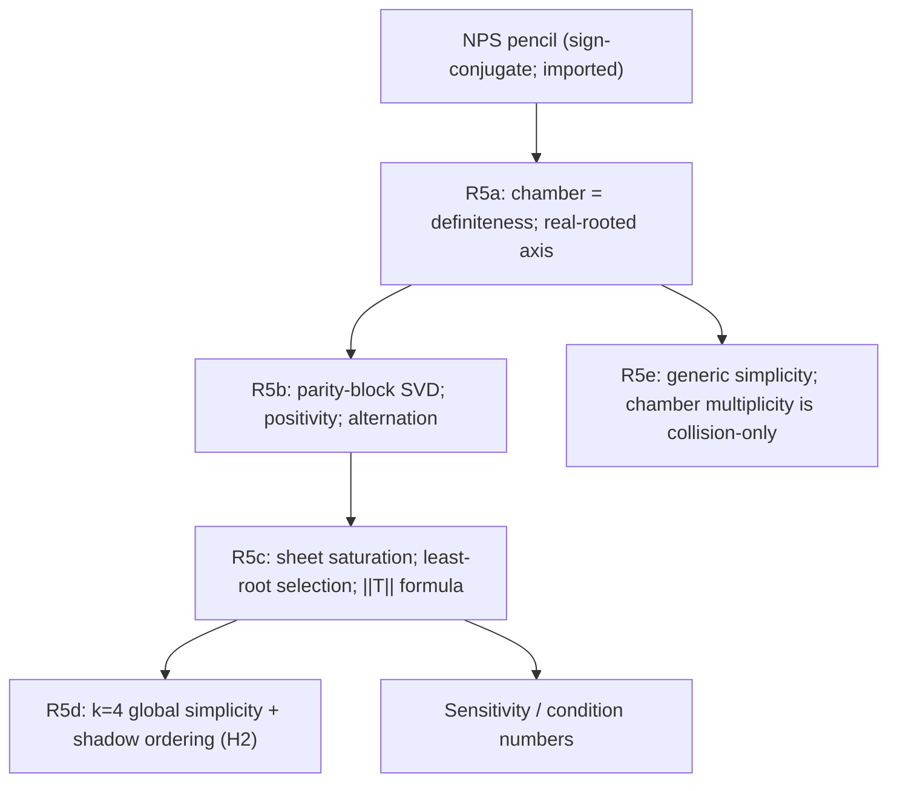

# RESEARCH_LOG ENTRY — R5: Total Reality, Spectral Factorization, and Physical-Root Selection — v2

**Program:** Galois–k-Ellipse Horizon Program (feedback into the Mathematical Object Emergence Ledger, OBJ-004)
**Targets:** R5 / THM-005 / PRED-003 / Stage 4 items 1–2 and the mathematical content of item 4; pre-registered absorption test (DEC-002).
**Date:** 2026-07-10 (v1 drafted, audited, counter-audited, and revised same day)
**Document status:** **v2 — PROMOTED ON GO 2026-07-10 (second GO of the day).** Verification chain: v1 draft → external audit (AUDIT_REPORT_R5_TOTAL_REALITY_AND_LEDGER_v0_2.md) → counter-audit (this revision; every audit claim independently re-verified, including exact symbolic recomputation of the equal-charge factorization `2^30 (3-u)(15-u)^4` and the parity-block Schur identity) → GO. The R5 package is **ESTABLISHED** as revised herein. Supersedes the v1 draft, which is retained (provenance over purity). One log entry, one commit.
**Provenance / inputs:** Research map v1.3; LOG_ENTRY_R6_R7_generic_descent_v2.md (Thm 4b, §3.1b — cited, not re-derived); MOEL v0.2 (OBJ-004 design, §7 promotion rule); NPS arXiv math/0702005; Plaumann–Vinzant arXiv 1207.7047 (definite-representation direction vs the HV converse); Castillo–Dietmann arXiv 1602.00314 (Hilbert irreducibility is "almost all," not "every").

**Changelog v1 → v2 (audit repairs R1–R6 and audit-proved additions, marked [v2]):**

1. **[R1]** Pencil attribution repaired: the entry's pencil is the **sign-conjugate** of the convention NPS display — orthogonally equivalent, same determinant and spectrahedral region — not character-for-character identical.
2. **[R2]** Remark D's per-point `S_5` claim deleted (Hilbert irreducibility: generic groups persist at *almost all* specializations, not all). Replaced with the corrected statement.
3. **[R3]** The proposed simplicity witness `(2,1,1,1,1)` violates (H2); recast as an exact **degeneracy witness** with certified factorization `N_4 = 2^30 (3-u)(15-u)^4` — pattern (1,4), matching Branch E's certified stratum. Distinct-charge witness replaced by `(3,1,2,3,4)`.
4. **[R4]** Absorption verdict rewritten and **strengthened toward absorption**: given a definite base point and oriented ray, spectrahedral theory canonically distinguishes the first boundary exit; in this realization the first exit *is* the physical root. What remains external is the physical/BPS interpretation and its thermodynamic/wall/reconstruction coupling.
5. **[R5]** Remark B qualified at zero-charge boundary strata; degenerate origin excluded.
6. **[R6]** Remark C's "one per unbalanced sign-pair" made a theorem (sheet saturation) rather than a slogan.
7. **[Additions §5–§6, audit §6, counter-audited]** Parity-block singular-value factorization; sheet-saturation theorem; physical root = unique least root; exact generalized-eigenvalue / Rayleigh / first-exit selection formula; strict coefficient-sign alternation; `k = 4` global simplicity + shadow-root ordering under (H2) alone; physical-root sensitivity formulas.
8. Clause (v) rewritten with the exact discriminant identity, `M > 0` from chamber strictness alone, and precise generic-vs-specialized wording.
9. §9 updated: the exact selection *rule* is proved; only a formally certified numerical implementation remains open.
10. §10 deltas enacted into map v1.4 and MOEL v0.3 on this GO.

---

## 0. Purpose and placement

This entry completes the map's independent high-value path (§6) in strengthened form:

```text
LMI / rigid convexity  ->  total reality  ->  spectral factorization
                                          ->  saturation and selection
                                          ->  exact physical-root formula.
```

Stage 4 items 1–2 are delivered; the **mathematical content of item 4 (the
selection rule) is delivered**; item 3 (interlacing) and the *certified
implementation* of item 4 remain open. With Stage 2 (entry R6/R7 v2) and R5
both promoted, the map's Stage 1 sequencing condition is satisfied: **the
paper freeze is unblocked.**



---

## 1. Setup and conventions

Pointwise over the reals: fix `k >= 1` and `(M, N) ∈ R^{k+1}`. Notation as
in entry R6/R7 v2 §1:

```text
w_i(u) = sqrt(u + N_i^2)        (real branch, u >= -min_i N_i^2),
s_eps(u) = sum_i eps_i w_i(u),   a_eps = sum_i eps_i        (imbalance),
Phi_k(m, M) = product_{eps} (4M - s_eps(m^2)) = N_k(m^2),
D_k = 2^k (k odd),  2^k - binom(k, k/2) (k even);  deg_u N_k = D_k/2.
```

**Strict physical chamber** `Cham = { 4M > sum_i |N_i| }`. On `Cham`,
`M > 0` automatically (`4M > Σ|N_i| >= 0`) **[v2, audit 4.8.2 — (H1) not
needed for this]**. The **physical root** `u_phys > 0` is the unique
solution of `g(u) := s_{(+,...,+)}(u) = 4M` on `u >= 0` (strict
monotonicity of `g`; audit 4.1 PASS). Hypotheses **(H1)** `N_i != 0`,
**(H2)** `N_i^2 != N_j^2` are invoked only where flagged.

### 1.1 The axial pencil (Stage 4 item 1)

With `σ_z = [[1,0],[0,-1]]`, `σ_x = [[0,1],[1,0]]`, slot operators
`Z_i, X_i` as usual, define

```text
A(x, y) = sum_i [ x·Z_i + (y - N_i)·X_i ],       L(x, y) = 4M·I_{2^k} - A(x, y),
L(m, 0) = L_0 - m·Z,     L_0 = 4M·I + sum_i N_i·X_i,     Z = sum_i Z_i.
```

**[v2, R1] Attribution.** This is the **sign-conjugate NPS pencil**: it is
orthogonally equivalent to the sign convention displayed by
Nie–Parrilo–Sturmfels (simultaneously flipping the signs of the slot Pauli
matrices is an orthogonal conjugation), hence has the same determinant and
the same positive-semidefinite region. All spectral statements below are
convention-independent.

**Spectral fact** (commuting slots; audit 4.2 PASS):
`spec A(x,y) = { s_eps : eps ∈ {±1}^k }` and

```text
det L(m, 0) = Phi_k(m, M) = N_k(m^2)        (identically; no normalization).
```

---

## 2. Imported and banked inputs

**(I-1)** NPS spectral/determinantal representation [IMPORTED, math/0702005;
sign-conjugate per §1.1].
**(I-2)** Definite-pencil lemma [classical; Lemma B; cf. Plaumann–Vinzant
1207.7047 for the definite-representation ⇒ hyperbolicity direction and its
distinction from the HV converse, which is nowhere used].
**(I-3) [v2]** Hilbert irreducibility as an "almost all" statement
[Castillo–Dietmann 1602.00314] — governs Remark D's corrected wording.
**(B-1)** Thm 4b generic irreducibility [ESTABLISHED, entry R6/R7 v2] — used
only in R5e.
**(B-2)** Leading-coefficient law §3.1b [ESTABLISHED] — `lc(N_k) != 0`
whenever `M != 0`; used in R5e and Remark C′.
**(B-3)** Isolation arguments [ESTABLISHED, entry R6/R7 v2 §9 / E-009] —
cited and instantiated; now *subsumed on the strict axial chamber* by the
saturation theorem R5c-0, which extends tangency-freeness from the physical
sheet to every crossing sheet.

---

## 3. Lemma A — the strict chamber IS the definiteness locus

**Lemma A.** `λ_min(L_0) = 4M - Σ_i |N_i|`. Hence `L_0 ≻ 0 ⟺ (M,N) ∈ Cham`
and `L_0 ⪰ 0 ⟺ 4M >= Σ_i |N_i|`. *(Audit 4.3: PASS exactly — "a genuine
exact bridge.")*

*Proof.* `spec A(0,0) = { -Σ_i eps_i N_i } = { Σ_i eps_i |N_i| }` as a set;
maximum `Σ_i |N_i|`. ∎

---

## 4. Lemma B — definite symmetric pencils are real-rooted along lines

**Lemma B (classical).** `L_0 ≻ 0`, `Z` symmetric, `q(t) = det(L_0 - tZ)`.
Then with `S = L_0^{-1/2} Z L_0^{-1/2}` (symmetric, real spectrum `μ_j`):

```text
q(t) = det(L_0) · product_j (1 - t·μ_j);
deg q = rank Z,  lc(q) != 0;  all roots real, roots = 1/μ_j (μ_j != 0),
root multiplicity = eigenvalue multiplicity;
inertia: #positive (negative) roots, with multiplicity,
         = #positive (negative) eigenvalues of Z    (Sylvester).
```

*(Audit 4.4: PASS exactly.)* HV's converse is nowhere used.

---

## 5. The theorem package — R5a through R5e

Restructured per audit §7: the strongest consequences are theorems, not
remarks; the structure also makes the absorption boundary explicit (§8).

Throughout, `(M, N) ∈ Cham`.

### R5a — Definite-pencil theorem (chamber, reality, degree, inertia)

```text
(1) L_0 ≻ 0, and Cham is exactly the region where this holds (Lemma A).
(2) q(m) = det(L_0 - mZ) = N_k(m^2) has deg_m q = rank Z = D_k, lc != 0,
    and EVERY root of q is real. q is even (X_all-conjugation, §7 Rem. A).
(3) Inertia: exactly #{eps : a_eps > 0} = D_k/2 positive m-roots, counted
    with multiplicity.
```

*(Audit 4.5: PASS. The `Z`-spectrum is `{a_eps}`; zero eigenspace has
dimension `binom(k,k/2)` for even `k`, zero for odd.)*

### R5b — Equivariant spectral quotient (parity-block SVD; positivity; alternation)

Let `X_all = σ_x^{⊗k}` (orthogonal involution). Then
`X_all L_0 X_all = L_0` and `X_all Z X_all = -Z`. In orthonormal bases of
the `±1` eigenspaces of `X_all` (each of dimension `2^{k-1}`):

```text
L_0 = [ A  0 ],   Z = [ 0   C ],       A ≻ 0,  B ≻ 0,
      [ 0  B ]        [ C^T 0 ]
T := A^{-1/2} C B^{-1/2},              rank C = rank T = D_k/2,
```

and

```text
N_k(u) = det(L_0) · product_{j=1}^{D_k/2} ( 1 - u·σ_j(T)^2 ),
```

the product over the **nonzero singular values of `T`, with multiplicity**.
Consequences:

```text
(1) Every root of N_k is u_j = σ_j(T)^{-2}: real and STRICTLY POSITIVE;
    in particular N_k(0) = det(L_0) > 0 — u = 0 is never a chamber root.
(2) Root multiplicity = singular-value multiplicity.
(3) Strict coefficient-sign alternation: writing
    N_k(u) = c_0 + c_1 u + ... + c_n u^n, n = D_k/2, we have
    (-1)^r c_r > 0 for every r — a free exact falsification gate for any
    symbolic expansion of N_k on the chamber.
```

*Proof.* Block Schur:
`det(L_0 - mZ) = det(A)·det(B - m^2 C^T A^{-1} C)
 = det(L_0)·det(I - u·T^T T)` with `u = m^2`; `T^T T ⪰ 0` has eigenvalues
`σ_j(T)^2`. Rank: `deg_u N_k = rank(T^T T) = rank C = D_k/2`. Alternation:
`c_r = det(L_0)·(-1)^r e_r(σ_1^2, ..., σ_n^2)` with all `σ_j^2 > 0`. ∎

*(Audit 6.1, 6.5; counter-audited. Cross-check: at `k = 4`, `n = 5`, the law
gives `c_5 < 0`, matching `lc(N_4) = -2^{24} M^6` from §3.1b. The direct
complex-square-root argument of v1 (audit 4.6 PASS) is retained as a second
proof of positivity.)*

### R5c — Sheet saturation and physical-root selection

**R5c-0 (Saturation).** On `Cham`:

```text
Every positive-imbalance sheet (a_eps > 0) crosses the level 4M at exactly
one u > 0, and that crossing is transverse (order 1). Sheets with
a_eps <= 0 have NO crossing. Consequently:
  - every multiple root of N_k on Cham is a COLLISION of crossings from
    distinct positive-imbalance sheets;
  - the critical-sheet mechanism (sum_i eps_i / w_i = 0 tangency) produces
    NO axial discriminant point inside the strict chamber — for ANY sheet,
    not only the physical one.
```

*Proof.* By R5a+R5b every root of `N_k` is real and `> 0`, so the total
root multiplicity in `(0, ∞)` equals `deg N_k = D_k/2` — the **budget**.
(The saturation theorem is thus a corollary of total reality, not
independent of it.) Each sheet with `a_eps > 0` satisfies
`s_eps(0) <= Σ|N_i| < 4M` and `s_eps(u) = a_eps·sqrt(u) + O(u^{-1/2}) → ∞`,
hence crosses at least once (IVT). Near any root `u_0 > 0` all `w_i` are
analytic and positive, so `ord_{u_0} N_k = Σ_eps ord_{u_0}(4M - s_eps)`.
The `D_k/2` positive-imbalance sheets therefore contribute at least
`D_k/2` to the budget; equality forces each to contribute exactly `1`
(one crossing, transverse — a tangency would cost `>= 2`) and all other
sheets to contribute `0`. ∎ *(Audit 6.2; counter-audited, with the
dependency on positivity made explicit.)*

**R5c-1 (Unique least root).** `u_phys` is the **unique least** root of
`N_k` at every point of `Cham`, and it is simple (order 1) without (H1) or
(H2).

*Proof.* Simplicity is R5c-0 applied to the all-plus sheet (equivalently,
the v1 argument — audit 4.7 PASS). Leastness: at a shadow crossing `u` of
sheet `eps` with `I_- = {i : eps_i = -1} != ∅`,

```text
4M = s_eps(u) = g(u) - 2·Σ_{i ∈ I_-} w_i(u)   ⇒   g(u) > 4M = g(u_phys),
```

and `g` strictly increasing gives `u > u_phys`. ∎ *(Audit 6.3.)*

**R5c-2 (Exact selection formula — generalized eigenvalue / Rayleigh /
first exit / operator norm).** With `S = L_0^{-1/2} Z L_0^{-1/2}` and `T`
as in R5b:

```text
m_phys = 1 / λ_max(S),                u_phys = λ_max(S)^{-2} = ||T||^{-2},

λ_max(S) = max_{v != 0} (v^T Z v)/(v^T L_0 v),

m_phys = m_first := sup { m >= 0 : L_0 - m·Z ⪰ 0 }
       — the FIRST SPECTRAHEDRAL EXIT along the oriented mass ray.
```

Equivalently: solve the largest positive generalized eigenvalue of
`Z v = λ L_0 v`; return `u_phys = λ^{-2}`.

*Proof.* By Lemma B the positive `m`-roots are `{1/μ : μ ∈ spec S, μ > 0}`;
by evenness the `m`-roots are `±sqrt(u-roots)`, so the least positive
`m`-root is `sqrt(u_phys)` (R5c-1), i.e. `m_phys = 1/λ_max(S)` with
`λ_max(S) > 0` (positive roots exist). In the parity basis
`S = [[0, T],[T^T, 0]]`, whose spectrum is `{±σ_j(T)} ∪ {0}`, so
`λ_max(S) = σ_max(T) = ||T||_op`. First-exit: for `m >= 0`,
`L_0 - mZ ⪰ 0 ⟺ I - mS ⪰ 0 ⟺ m·λ_max(S) <= 1`. ∎
*(Audit 6.4 + R4; counter-audited.)*

**R5c-3 (Sensitivity / condition numbers).** Implicit differentiation of
`g(u_phys) = 4M`:

```text
∂u_phys/∂M   =  8 / Σ_i (1/w_i(u_phys))  >  0,
∂u_phys/∂N_j = -2 N_j / [ w_j(u_phys) · Σ_i (1/w_i(u_phys)) ].
```

The selected mass-square root increases strictly in `M` and decreases as a
fixed-sign charge magnitude grows; these are the condition numbers for
certified numerical continuation. *(Audit 6.7; verified.)*

### R5d — Four-channel global simplicity and shadow ordering

For `k = 4`, assume **(H2) only** (at most one zero charge is then
automatic; (H1) is not needed). Then at **every** point of `Cham`:

```text
(1) all five roots of N_4 are simple — GLOBAL, not generic;
(2) the four shadow roots are canonically and strictly ordered by charge
    magnitude: |N_i| > |N_j|  ⇒  u_shadow(i) > u_shadow(j).
```

*Proof.* The positive-imbalance sheets are all-plus (`a = 4`) and the four
one-minus sheets (`a = 2`); each crosses once transversely (R5c-0). A
multiple root would need two sheets crossing at the same `u`: all-plus vs
one-minus differ by `2w_i > 0` (never); one-minus `i` vs one-minus `j`
differ by `2(w_j - w_i)`, zero iff `N_i^2 = N_j^2`, excluded by (H2).
Ordering: `|N_i| > |N_j| ⇒ w_i(u) > w_j(u)` for all `u >= 0`, so
`h_i := g - 2w_i < h_j` pointwise; at `u_j` (crossing of `j`),
`h_i(u_j) < h_j(u_j) = 4M`; since `h_i` has a single transverse crossing
and `h_i → +∞`, the set `{h_i > 4M}` is `(u_i, ∞)`, forcing `u_j < u_i`. ∎
*(Audit 6.6; counter-audited, ordering step completed via saturation.)*

### R5e — Generic simplicity for all k (corrected wording)

Assume (H1), (H2). For a degree-`n` polynomial `f`,

```text
Disc(f) = (-1)^{n(n-1)/2} · Res(f, f') / lc(f),
```

a polynomial in the coefficients of `f`. Thm 4b (B-1) gives `N_k`
irreducible over `F`, hence separable (char 0), hence
`Res_u(N_k, dN_k/du) != 0` in `F`; with `lc(N_k) != 0` on `M > 0` (B-2) —
and `M > 0` holds on all of `Cham` — `Disc_u N_k` is a **nonzero
polynomial** in `(M, N)`. Its real zero set meets `Cham` in a proper
relatively-closed real-algebraic subset `Sigma`; on `Cham \ Sigma` all
`D_k/2` roots of `N_k` are simple. On all of `Cham`, by R5c-0, every
multiple root is an inter-sheet **collision** among positive-imbalance
sheets — never a tangency.

**Scope (audit 4.8.3, guardrail-grade):** generic irreducibility proves
the discriminant *polynomial* is nonzero. It does **not** prove
irreducibility, separability, or `S_5` at every real point satisfying
(H1)/(H2): specialized instances require per-point certification.

---

## 6. Degeneracy and distinct-charge witnesses **[v2, R3]**

**Exact degeneracy witness (retained, repurposed).** The point
`(M, N) = (2, 1, 1, 1, 1)` lies in `Cham` but violates (H2). Grouping the
sixteen sheets by imbalance (`a ∈ {±4, ±2, 0}` with multiplicities
`(1,1,4,4,6)`) gives the **exact** factorization

```text
N_4(u) = 2^30 · (3 - u) · (15 - u)^4,
u_phys = 3 (simple),     u_shadow = 15 (multiplicity 4),
```

independently re-verified symbolically in the counter-audit. This is an
exact certificate of Branch E's all-equal stratum pattern **(1, 4)** — the
first fully explicit instance — and a live demonstration of R5d's
contrapositive (four (H2)-violations ⇒ fourfold shadow collision). It
cannot certify simplicity; it certifies the degeneracy lattice.

**Distinct-charge witness (replacement).** `(M, N) = (3, 1, 2, 3, 4)`:
`4M = 12 > 10 = Σ|N_i|`, (H1)/(H2) hold. Queued Cella certificate: exact
Sturm-sequence or rational-interval isolation of the five roots (a
floating-point pre-read shows five separated positive roots; per the
aperture doctrine the float is the scout, and only the exact certificate
will be banked).

---

## 7. Remarks

**Remark A (matricial deck avatar — now load-bearing).** `X_all = σ_x^{⊗k}`
realizes `τ : m → -m` by conjugation; the pencil's `Ad(X_all)`-even part is
`L_0`, odd part `m·Z`. In v1 this was decoration; in v2 it is the engine of
R5b: **the deck involution is the parity grading of the spectral problem**,
and the mass fiber is the singular-value spectrum of the odd block in the
even metric. Feeds Branch B item 3 and Branch F.

**Remark B (closed-chamber limit — qualified) [v2, R5-corr].** On the
nontrivial closed chamber (`M > 0`), real-rootedness and nonnegativity pass
to the boundary `4M = Σ|N_i|` at fixed degree (lc nonvanishing, B-2), and
the physical branch reaches `u = 0` — the all-plus component of the signed
axial-contact divisor (R18). If all charges are nonzero it is the **unique**
signed sheet at that contact; **zero-charge channels permit additional
shadow sheets to meet the same point** (flipping signs in zero channels
does not move `s_eps(0)`). The degenerate origin `(M, N) = (0, 0)` is
excluded from any fixed-degree continuity statement (even-`k` lc collapse).
Remark-grade.

**Remark C′ (root count — now a theorem) [v2, R6].** "One root per
positive-imbalance sheet" is R5c-0 verbatim; with multiplicity it is R5a(3)
by inertia. The equal-charge witness (§6) shows why "with multiplicity"
mattered: four sheets, one `u`-value.

**Remark D (arithmetic specializations — corrected) [v2, R2].** Every
strict-chamber specialization of `N_4` has five positive real roots counted
with multiplicity (R5b). At any rational or algebraic chamber
specialization for which `N_4` is *additionally certified* irreducible with
Galois group `S_5`, the resulting quintic field is totally real. **Generic
`S_5` does not imply `S_5` at every chamber point** (Hilbert irreducibility
is an almost-all statement, I-3); arithmetic instances must be certified
per point. Branch I inherits this wording.

**Remark E (what strictness buys).** Unchanged from v1: definiteness of
`L_0`; `N_k(0) > 0`; `u_phys > 0`. The boundary costs exactly strictness,
per Remark B.

---

## 8. Absorption test — rewritten verdict **[v2, R4; pre-registered, DEC-002]**

**Registered question:** is the proof verbatim Helton–Vinnikov / verbatim
hyperbolicity theory with symbols renamed?

**Finding 1 (literal): NO.** The HV converse is nowhere used (Plaumann–
Vinzant distinction, I-2).

**Finding 2 (honest, strengthened by the audit): the absorption is LARGER
than v1 claimed.** v1 asserted "hyperbolicity theory has no distinguished
root." That is too strong: given a definite base point and an **oriented
ray**, spectrahedral theory canonically distinguishes the first boundary
exit, `m_first = 1/λ_max(S)` — and in this realization `m_first = m_phys`
(R5c-2). Equivariant definite-pencil theory therefore absorbs:

```text
- bare total reality;
- positivity after the even quotient (parity grading + definiteness);
- root multiplicity as spectral (singular-value) multiplicity;
- first-exit / least-root SELECTION — the mechanism itself.
```

**Finding 3 (the residue).** What that parent does **not** supply:

```text
- why THIS chamber and THIS oriented ray are physically selected;
- the horizon/thermodynamic meaning of the selected branch;
- the BPS meaning of the relevant norm-wall component (R18/guardrail 12);
- the coupling to the wider cover / covariant / reconstruction package
  (E-010, THM-002, Branch F parity dictionary).
```

**Verdict: SPLIT, conservative side.** The selection **mechanism** is
spectral and absorbed; the selection **meaning** is not. Consequently:

```text
THM-005a  (definite pencil over the strict chamber ⇒ real axial fiber;
           parity involution ⇒ positive quotient fiber; first-exit
           eigenvalue formula)
           = TRANSLATED / PROVED in this realization. Native count: NO.

THM-005b  (the physically selected branch = the first spectrahedral exit
           = the distinguished BPS wall component, compatibly with cover
           covariants and wall data)
           = CANDIDATE-NATIVE BRIDGE; PROVED in the founding realization;
           abstract candidate-language form remains LEAD.
           Native count: NOT YET.
```

**Do not count R5 alone toward G4-02** (audit ruling, accepted on
counter-audit). A candidate-native theorem still requires an intrinsic
formulation whose content survives after the full spectral mechanism is
removed. **Thesis note for the ledger (wording to be ratified):** the
program slogan "the physics is the selection" is sharpened by this result
to "the selection is spectral; **the physics is the interpretation of the
selection**" — REM-001 narrows accordingly, it does not dissolve.

---

## 9. What this entry does NOT prove **[v2, updated per audit §7]**

```text
1. Interlacing of roots under variation of M or charges (Stage 4 item 3)
   remains open; R5c-3's sensitivity formulas are its derivative layer.
2. The exact selection RULE is proved (R5c-2): u_phys is the unique least
   root, equal to the inverse square of the largest generalized eigenvalue
   of (Z, L_0). What remains open is a FORMALLY CERTIFIED numerical
   implementation with rational interval bounds — a named Cella consumer.
3. Nothing about Galois or monodromy groups. R9 untouched. Generic groups
   do not transfer to specializations (Remark D; new guardrail 15).
4. Real-rootedness off the closed chamber, or for planar line restrictions
   not through a definiteness point (guardrail 14).
5. Branch I item (d) — the Entry-4 gate — is UNTOUCHED by this entry and
   still REQUIRED for the generic degree-20 crown and the R19 corollary.
6. R18's infinite-place sweep: untouched.
```

---

## 10. Register, map, and ledger deltas — **ENACTED (GO 2026-07-10)**; carried into map v1.4 and MOEL v0.3

```text
Map:     R5 ESTABLISHED (package R5a–e); new register row R20 (selection
         formula + sensitivity); Branch D discharged; Branch E saturation
         + exact (1,4) certificate; Branch F/B Remark-A avatar; Branch I
         corrected arithmetic wording + Cella consumer; Stage 4 items 1–2
         DONE, item 4 split (rule PROVED / implementation OPEN); Stage 1
         UNBLOCKED; guardrails 13 annotated, 14 and 15 added; trunk
         addition promoted; anchors + internal artifacts updated.
Ledger:  E-007 SUPERSEDED; E-012, E-013 added PROVED; PRED-003 CONFIRMED
         (strict positivity); THM-005 split into 005a/005b per §8; REM-001
         narrowed; NS-001 founding-family note; NS-007/E-008 chamber
         restriction; loss-matrix rows updated (stronger absorption);
         OBJ-004 COMPLETE; DEC-003 appended; CAND-001 HELD AT S2; queue
         head advances to OBJ-002 / PRED-006.
```

## 11. Verification record and remaining queue

```text
Chain: v1 draft -> external audit -> counter-audit (this doc; all audit
mathematics independently re-verified: block Schur, saturation counting
incl. its dependence on positivity, least-root argument, first-exit
equivalence, k=4 ordering completion, sensitivity formulas, exact
recomputation of 2^30(3-u)(15-u)^4, Disc identity, chamber ⇒ M > 0)
-> GO 2026-07-10 (Will; instruction of record: enact into the two running
files). Any disputed counter-audit acceptance reverts by one flag + a
decision-log row.

Queued Cella certificates (named consumers; NOT executed — no run GO):
  a. Certified extremal generalized eigenvalue of Z v = λ L_0 v with
     rational interval bounds, returning u_phys = λ^{-2} with certified
     enclosure  [THE named consumer for Stage 4 item 4; also a candidate
     consumer for the CCAF certified-enclosure program].
  b. Exact Sturm / interval isolation at (3, 1, 2, 3, 4): five simple
     positive roots  [replaces the invalid v1 witness].
  c. Alternation gate: verify (-1)^r c_r > 0 on any symbolic N_k expansion
     [free falsification check; add to constructor harness].
  d. (Banked already, this entry:) exact factorization at (2,1,1,1,1) —
     pattern (1,4) certificate.

One log entry, one commit (path-scoped add; this file plus map v1.4 plus
MOEL v0.3 = three commits per the standing one-artifact-one-commit rule).
```
