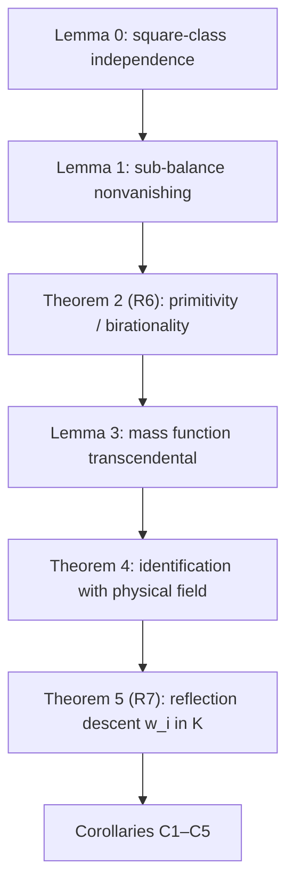

# RESEARCH_LOG ENTRY — R6 + R7: Generic Birationality and Reflection Descent — v2

**Program:** Galois–k-Ellipse Horizon Program
**Targets:** R6 (incidence normalization / birationality) and R7 (generic reflection descent `w_i ∈ K`), stated and proved for general `k`; corollaries specialized to `k = 4`.
**Date:** 2026-07-10 (v1 drafted, audited, counter-audited, and revised same day)
**Document status:** **v2 — PROMOTED ON GO 2026-07-10.** Verification chain: v1 draft → external audit (AUDIT_REPORT_R6_R7_GENERIC_DESCENT.md) → counter-audit of the audit → GO. R6 and R7 are **ESTABLISHED** as revised herein. Items marked **CONDITIONAL** remain gated (see §11–§12). Supersedes the v1 draft, which is retained (provenance over purity). One log entry, one commit.
**Provenance / inputs:** Research map v1.1–v1.2 (§2 bridge, §3.1 + §3.1b degree and leading-coefficient laws, §4 cover tower and degree ledger, Branch A, Branch E, Branch G, Branch H corrected loci, §6 critical path, §9 guardrails); RESEARCH_LOG Entry 4 (07-10 square-class run at point B); AUDIT_REPORT_R6_R7_GENERIC_DESCENT.md (07-10); NPS arXiv math/0702005. Where a new proof route duplicates an established result, **both are retained** and the duplication is flagged — provenance over purity.

**Changelog v1 → v2 (all repairs from the audit, plus counter-audit additions, marked [v2]):**

1. Theorem 2(v): the false one-liner "birational integral curves have isomorphic normalizations" is deleted (counterexample: `A^1` vs `A^1 \ {0}`). Replaced by the audit's smoothness + finite-birational proof, with the Jacobian elimination spelled as a two-step. R6 emerges **stronger**: `C` is the affine normalization of `X`.
2. Theorem 5 remark: ramification corrected to the `ord_v(u)`-odd criterion; `u = 0` qualified as the **signed axial-contact divisor**, of which only the all-plus physical-chamber component is the static BPS/extremal contact locus; infinite places flagged unswept.
3. C2 reframed as explicitly conditional: the generic degree-20 crown is gated on a recorded good-specialization statement for point B plus independent re-verification of the Entry 4 certificate (queued, Branch I item d); the specialized degree-20 eliminant route recorded as an equally clean alternative.
4. New Proposition P6 (from audit §8, with π-normalization fix and the `beta != 0` discharge): `F(Shat_+, Shat_-) = K(m, y)` — `K(m,y)` earns the name "ordered-horizon field"; either horizon alone generates it via the area product.
5. §9: discriminant scope corrected — sub-balance varieties give the **sheet-collision** components only; the critical-sheet mechanism `sum_i eps_i / w_i = 0` recorded as separate; leading-coefficient collapse noted as boundary-grade; **isolation upgraded** — the physical sheet is free of BOTH mechanisms.
6. Theorem 2(iii): evenness stated directly via the involution `m -> -m`, `w_i -> w_i` (audit wording improvement).
7. §10–§12 updated from proposal to record.

---

## 0. Purpose and placement

This entry supplies the two proofs the map's critical path (§6) begins with:

```text
incidence normalization  ->  generic radical descent  ->  exact field tower  ->  full horizon-cover group
```

Concretely: it proves the birationality lemma behind R6 and the fixed-field
descent behind R7, at the function-field level, for every `k` satisfying the
standing genericity hypotheses. Consequence: every "at B; generic by
specialization" asterisk attached to the **descent** (guardrail 6, clause on
`w_i ∈ K`) is removed. The field-degree statements acquire an independent
generic re-derivation. Group statements are untouched (R9 remains open).

**[v2]** The audit confirmed the core chain intact — Lemma 0, Lemma 1,
Theorem 2(i–iv), Lemma 3, Theorem 4, Theorem 5 all PASS unmodified. The two
repairs (normalization, ramification) land on remarks and geometric
packaging, not on the descent chain itself.



---

## 1. Setup and conventions (general k)

Fix `k >= 1`. Coefficient and observable fields:

```text
F0 = Q(N_1, ..., N_k) = Q(Q_1, ..., Q_k)      (N_i = 4Q_i; same field),
L  = F0(m),                                    m transcendental over F0,
F  = F0(M),                                    M a further independent
                                               transcendental — the observable
                                               field; for k = 4 this is
                                               F = Q(M, Q_1, ..., Q_4) of §3.2.
```

Incidence data:

```text
d_i = m^2 + N_i^2 ∈ L,
W   = L(w_1, ..., w_k),      w_i^2 = d_i,
s   = w_1 + ... + w_k.
```

Physical seed field, once irreducibility is in hand (Theorem 4):

```text
K = F[u]/(N_k(u)),           u = m^2.
```

**Standing genericity hypotheses.**

```text
(H1)  N_i != 0            for all i;
(H2)  N_i^2 != N_j^2      for all i != j.
```

Both hold automatically for independent transcendentals. They are listed
because their failure strata are exactly the Branch E/H degeneracies (§9).

**Convention.** Display polynomial `Phi_k(m, M)` denotes the axial `k`-ellipse
polynomial with the radius `4M` promoted to a coordinate:

```text
Phi_k(m, M) = product_{eps in {+1,-1}^k} ( 4M - sum_i eps_i w_i ).
```

Theorem 2(iii) shows `Phi_k ∈ F0[m, M]`, even in `m`, with
`Phi_k(m, M) = N_k(m^2)` — i.e. `Phi_k` **is** the program's `p_k(m, 0)` of
map §2, with the `M`-dependence made explicit. Equivalently
`Phi_k = ± Res_u(N_k(u), m^2 - u)` up to unit, matching the ledger's `E_u`
construction.

---

## 2. Lemma 0 — square-class independence

**Lemma 0.** Assume (H1), (H2). Then the classes `[d_1], ..., [d_k]` are
linearly independent in `L*/L*^2`. Consequently

```text
[W : L] = 2^k,
Gal(W/L) = (Z/2)^k,
```

generated by the sign flips `sigma_j : w_j -> -w_j`, `w_i -> w_i (i != j)`,
identity on `L`.

**Proof.** Work in the UFD `F0[m]` with `L` its fraction field. Each `d_i` is
squarefree: `gcd(d_i, d_i') = gcd(m^2 + N_i^2, 2m) = 1` since `N_i != 0`
(H1). For `i != j`, `d_i` and `d_j` are coprime: a common root would force
`N_i^2 = N_j^2`, excluded by (H2). Hence for any nonempty
`S ⊆ {1, ..., k}`, the product `prod_{i in S} d_i` is a squarefree
polynomial of positive degree; every irreducible factor occurs with
valuation exactly 1. A square in `L*` has even valuation at every prime of
`F0[m]`, so `prod_{i in S} d_i` is not a square in `L`. By Kummer theory for
multiquadratic extensions, independence of every nonempty product gives
`[W : L] = 2^k` with `Gal(W/L) = (Z/2)^k` acting by the stated sign flips. ∎

**Failure loci:** exactly (H1) (channel shutoff `N_i = 0`) and (H2) (focal
coincidence `N_i^2 = N_j^2`). See §9.

---

## 3. Lemma 1 — sub-balance nonvanishing (function-field level)

**Lemma 1.** Assume (H1), (H2). For every nonempty `S ⊆ {1, ..., k}` and every
choice of signs `sigma_i ∈ {+1, -1}` (`i ∈ S`),

```text
t := sum_{i in S} sigma_i w_i  !=  0     in W.
```

**Proof.** Suppose `t = 0`. Pick `j ∈ S` and apply the automorphism
`sigma_j ∈ Gal(W/L)` supplied by Lemma 0:

```text
sigma_j(t) = t - 2 sigma_j w_j.
```

Since `t = 0`, also `sigma_j(t) = sigma_j(0) = 0`, forcing `w_j = 0`. But
`w_j^2 = d_j != 0` in `L`. Contradiction. ∎

**Remark (Branch E shadow).** Lemma 1 is unconditional at the function-field
level. Under **specialization** of the parameters, its conclusion fails
exactly on the signed sub-balance varieties `sum_{i in D} sigma_i w_i = 0`
— the certified discriminant components of Branch E. See §9.

---

## 4. Theorem 2 (R6) — primitivity and birationality

**Theorem 2.** Assume (H1), (H2). With `s = sum_i w_i` and, for each sign
vector `eps ∈ {+1,-1}^k`, `s_eps = sum_i eps_i w_i`:

```text
(i)    The 2^k conjugates s_eps are pairwise distinct in W, and they form
       the full Gal(W/L)-orbit of s.

(ii)   L(s) = W.    (The stabilizer of s is trivial.)

(iii)  Phi_k(m, M) = product_eps (4M - s_eps) lies in F0[m, M], is even
       in m, and Phi_k(m, M) = N_k(m^2) with the M-dependence explicit.

(iv)   Phi_k is irreducible in L[M], and hence in F0[m, M].

(v)    Geometric form [v2, strengthened]: let
       C = Spec F0[m, w_1..w_k]/(w_i^2 - d_i) and let
       X = V(Phi_k) ⊂ A^2_(m,M) be the axial curve. Then
       phi : C -> X, (m, w) |-> (m, s/4), is birational; moreover, under
       (H1) and (H2), C is smooth, hence normal, and

           C is the affine normalization of X

       — the precise content of "incidence normalization" (Stage 2, item 2),
       now at scheme level rather than function-field level only.
```

**Proof.**

*(i)* For subsets `T ⊆ {1..k}`, `sigma_T(s) = s_{eps(T)}` where
`eps(T)_i = -1` iff `i ∈ T`; as `T` ranges over all subsets, `eps(T)` ranges
over all of `{+1,-1}^k`, so the orbit of `s` is `{s_eps}`. Distinctness: for
`eps != eps'`,

```text
s_eps - s_eps' = 2 sum_{i : eps_i != eps'_i} eps_i w_i  !=  0
```

by Lemma 1 (the support is nonempty). Hence all `2^k` values are distinct.

*(ii)* Orbit size `2^k` equals `[W : L]`, so the stabilizer of `s` in
`Gal(W/L)` is trivial; by the Galois correspondence `Gal(W/L(s))` equals that
stabilizer, so `L(s) = W`.

*(iii)* Expand the product in `F0[m][w][M]` and reduce modulo
`(w_i^2 - d_i)`. The coefficients of powers of `M` are invariant under
`(Z/2)^k`; the invariant subring of the reduced ring
`⊕_{A ∈ {0,1}^k} F0[m] · w^A` is the `A = 0` component `F0[m]`. Hence
`Phi_k ∈ F0[m][M]`. Moreover no factor `4M - s_eps` contains `m` outside the
`w_i`, so every coefficient is a polynomial in the `d_i = m^2 + N_i^2` and
integers — even in `m`. Writing `Phi_k(m, M) = 𝒩(m^2, M)` and comparing with
map §2, `𝒩(u, M)` is definitionally the signed-radical norm: the product
defining `Phi_k` **is** the product defining `p_k(m, 0)`. So
`Phi_k(m, M) = N_k(m^2)` with `M` explicit. **[v2, direct statement per
audit]** Evenness in one line: the involution `m -> -m`, `w_i -> w_i`
preserves the relations `w_i^2 = d_i` and fixes every factor `4M - s_eps`
(no bare `m` appears in any factor), hence fixes `Phi_k`; its coefficients
in `F0[m]` are therefore even.

*(iv)* As a polynomial in `M` over `L`, `Phi_k = 4^{2^k} prod_eps (M - s_eps/4)`
is a unit multiple of `prod_eps (M - s_eps/4)`, which is monic, Galois-stable,
has `s/4` as a root, and has degree `2^k` = the degree of `s/4` over `L` by
(ii). It is therefore the minimal polynomial of `s/4`; hence `Phi_k` is
irreducible in `L[M]`. Its leading `M`-coefficient `4^{2^k}` is a unit of
`F0[m]`, so `Phi_k` is primitive over `F0[m]`; by Gauss's lemma it is
irreducible in `F0[m][M] = F0[m, M]`.

*(v)* The coordinate ring of `C` is the free `F0[m]`-module
`⊕_A F0[m] · w^A`, which embeds into the field `W` (Lemma 0 gives
`dim_L = 2^k = [W : L]`), so `C` is integral with function field `W`. Since
`(Phi_k)` is prime and `(Phi_k) ∩ F0[m] = 0` (positive `M`-degree), `X` is
integral with function field `L[M]/(Phi_k) ≅ L(s/4) = L(s) = W` by (ii),(iv).
The map `phi` induces this isomorphism of function fields (`M |-> s/4`,
well-defined on coordinate rings since `s/4` lies in the coordinate ring of
`C`), so `phi` is birational.

**[v2] Normalization (replaces a false v1 implication).** The v1 sentence
"birational integral curves have isomorphic normalizations" is deleted: it is
false for affine curves in general (`A^1` and `A^1 \ {0}` are birational,
both normal, not isomorphic). The correct statement is proved directly.

*Smoothness of `C`.* The Jacobian of the system `f_i = w_i^2 - m^2 - N_i^2`
has rows

```text
row_i = ( -2m, 0, ..., 0, 2w_i, 0, ..., 0 ),
```

with `2w_i` in the `w_i`-column. At a geometric point of `C` where every
`w_i != 0`, the `k x k` minor on the `w`-columns is `diag(2w_i)`,
invertible — rank `k`. If some `w_i = 0`: first, at most one index can
vanish, since `w_i = w_j = 0` forces `m^2 = -N_i^2 = -N_j^2`, contradicting
(H2); second, `m != 0` there, since `0 = w_i^2 = m^2 + N_i^2` gives
`m^2 = -N_i^2 != 0` by (H1). Now run the elimination in two steps: in any
dependence `sum_r lambda_r row_r = 0`, each `w_j`-column with `j != i` reads
`2 lambda_j w_j = 0`, killing `lambda_j`; with those dead, the `m`-column
reads `-2m lambda_i = 0`, and `m != 0` kills `lambda_i`. Rank `k`
everywhere, so `C` is smooth of dimension 1; smooth over a field implies
regular implies normal.

*Finiteness and the normalization identification.* The map
`F0[m, M] -> A_C`, `M |-> s/4`, has kernel `(Phi_k)` (the Theorem 4 kernel
computation, restricted to the coordinate ring `A_C ⊂ W`), so
`A_X = F0[m, M]/(Phi_k)` embeds in `A_C`. Each `w_i` is integral over
`F0[m] ⊆ A_X` via the monic relation `w_i^2 = d_i`, and `A_C` is generated
over `A_X` by the `w_i`, so `A_C` is a finite `A_X`-module. Both are domains
with the same fraction field `W` (birationality above). `A_C` is normal
(smooth). Hence: the integral closure of `A_X` in `W` contains `A_C`
(integrality) and is contained in `A_C` (normality of `A_C` plus integrality
of the closure over `A_C`), so `A_C` **is** the integral closure. Therefore
`C` is the affine normalization of `X`. ∎

**Scope guardrail [v2, updated].** Statement (v) now carries the affine
normalization at scheme level. Still not claimed: the projective closure,
the singularity classification of `X` (which points of `X` are singular,
their types, the genus computation), or any regular compactified model —
that remains Branch H / Jiang–Han territory and is not needed for descent.

---

## 5. Lemma 3 — the mass function is transcendental

**Lemma 3.** Assume (H1), (H2). Then `s` (hence `M = s/4`) is transcendental
over `F0` inside `W`.

**Proof.** Char 0 and `W/L` finite separable, so the derivation `D = d/dm` on
`L` (killing `F0`) extends uniquely to `W`. From `w_i^2 = m^2 + N_i^2`:

```text
D(w_i) = m / w_i,
D(s)   = m * sum_i 1/w_i = m * e_{k-1}(w) / e_k(w),
```

with `e_j` the elementary symmetric polynomials. Here `m != 0` and
`e_k(w) = prod_i w_i != 0`. For `e_{k-1}`: apply `sigma_1`. Every term of
`e_{k-1}(w) = sum_i prod_{j != i} w_j` except the `i = 1` term contains `w_1`
and is negated; the `i = 1` term is fixed. Hence

```text
e_{k-1} + sigma_1(e_{k-1}) = 2 prod_{j != 1} w_j != 0,
```

so `e_{k-1} = 0` would force `sigma_1(e_{k-1}) = 0` and thus
`prod_{j != 1} w_j = 0`, a contradiction. Therefore `D(s) != 0`.

Finally, any `a ∈ W` algebraic over `F0` satisfies `D(a) = 0`: if `q` is its
minimal polynomial over `F0`, then `0 = D(q(a)) = q'(a) D(a)` with
`q'(a) != 0` (char 0, minimality). Since `D(s) != 0`, `s` is transcendental
over `F0`. ∎

---

## 6. Theorem 4 — identification with the physical field; generic minimality for all k

**Theorem 4.** Assume (H1), (H2). Let `psi : F0[M, m] -> W` be the
`F0`-algebra map `M |-> s/4`, `m |-> m`. Then:

```text
(0)  ker psi = (Phi_k), and psi induces an isomorphism of fields over F

         F[m] / (Phi_k)  ≅  W,        M  |->  s/4.
```

Consequences:

```text
(a)  Phi_k is irreducible over F;    [W : F] = deg_m Phi_k = D_k.

(b)  N_k(u) is irreducible over F;   [K : F] = delta_k.
     The physical seed has minimal degree delta_k GENERICALLY, for every k.
     This settles the §3.1 "important distinction" clause at the generic
     level: k = 5 minimal degree 16; k = 6 minimal degree 22.

(c)  Under the isomorphism, W = F(m) is the ledger field K(m),
     generically; in particular each signed radical satisfies

         w_i ∈ F(m).

(d)  (a)–(b) re-derive, generically and independently, the DEGREE content
     of the point-B certificates (E_u irreducible degree 10 at k = 4; the
     prose wall-norm proof). Both routes are retained. Group statements
     (S_5, closure groups) are NOT touched by this theorem.
```

**Proof.**

*(0)* `Phi_k(m, s/4) = 0` because the all-plus factor of the product is
`4(s/4) - s = 0`; so `(Phi_k) ⊆ ker psi`. The image of `psi` sits inside the
field `W`, so `ker psi` is prime. By Lemma 3, `ker psi ∩ F0[M] = 0`. Now
`(Phi_k)` is a height-1 prime of the 2-dimensional finitely generated domain
`F0[M, m]` (Theorem 2(iv)). If `ker psi` strictly contained `(Phi_k)` it
would be maximal; by Zariski's lemma its residue field would be finite over
`F0`, making the image of `M` algebraic over `F0` and forcing
`ker psi ∩ F0[M] != 0` — contradiction. Hence `ker psi = (Phi_k)`.

Localize at `S = F0[M] \ {0}`: by Lemma 3, `psi(S)` consists of nonzero —
hence invertible — elements of `W`, so `psi` extends to an injection

```text
F[m]/(Phi_k)  =  S^{-1}( F0[M, m]/(Phi_k) )  ↪  W.
```

The source is a domain (localization of a quotient by a prime) and is
finite-dimensional over the field `F`, because the leading `m`-coefficient of
`Phi_k` is a unit of `F` — it is the §3.1b leading-coefficient value, nonzero
(`k = 4`: `-2^24 M^6`; odd `k`: a positive perfect square). A
finite-dimensional domain over a field is a field. Its image in `W` is
therefore a subfield containing `m` and `s`, hence containing
`F0(m)(s) = L(s) = W` by Theorem 2(ii). So the injection is an isomorphism.

*(a)* `F[m]/(Phi_k)` a field forces `Phi_k` irreducible over `F`;
`[W : F] = deg_m Phi_k = D_k` (the count of unbalanced sign vectors —
balanced factors have `m`-degree 0).

*(b)* If `N_k = g h` nontrivially over `F`, then
`Phi_k(m) = N_k(m^2) = g(m^2) h(m^2)` factors over `F`, contradicting (a).
So `N_k` is irreducible over `F` and `[K : F] = delta_k`. Both parities
satisfy `D_k = 2 delta_k`:

```text
k odd:   D_k = 2^k             = 2 * 2^(k-1);
k even:  D_k = 2^k - C(k,k/2)  = 2 * (2^(k-1) - (1/2) C(k,k/2)).
```

*(c)–(d)* Immediate from (0), (a), (b) and the ledger. ∎

**Remark (legitimacy of the identification).** The observable field `F` is
by construction purely transcendental over `F0` — the model's observables
carry no relations. Lemma 3 shows the incidence curve realizes exactly such
an `F` via `M = s/4`, with the `k`-channel mass relation holding
tautologically on `C`. The identification is the unique `F0`-embedding
sending the abstract mass observable to the curve's mass function;
physically, "`4M` is the sum of channel distances" is the definition of the
model.

---

## 7. Theorem 5 (R7) — reflection descent

**Theorem 5.** Assume (H1), (H2). There is `tau ∈ Aut(W)` with

```text
tau(m) = -m,        tau(w_i) = w_i  (all i),        tau|_{F0} = id.
```

Then `tau` fixes `F` and `K` pointwise, `tau` generates `Gal(W/K)`, and

```text
W^tau = K,           hence           w_i ∈ K     for all i.
```

**Proof.** The `F0`-automorphism `m |-> -m` of `L` fixes every
`d_i = m^2 + N_i^2`, so it extends along the tower
`L ⊂ L(w_1) ⊂ ... ⊂ W`, choosing at each step the extension with
`w_i |-> w_i` (a square root of `tau(d_i) = d_i`). Then `tau^2` fixes all
generators, so `tau^2 = id`; and `tau != id` since it moves `m`.

`tau(s) = s`, so under the Theorem 4 identification `tau` fixes `F = F0(M)`
pointwise; `tau(u) = tau(m)^2 = u`, so `tau` fixes `K = F(u)` pointwise. By
Theorem 4(b), `[W : K] = D_k / delta_k = 2`, and `tau` is a nontrivial
element of `Aut(W/K)`; a degree-2 extension in characteristic 0 is Galois,
so `Gal(W/K) = <tau>` and `W^tau = K`.

Each `w_i` is `tau`-fixed by construction, hence lies in `K`. ∎

**Remark (ramification, corrected) [v2].** For the quadratic `W = K(m)`,
`m^2 = u`, in characteristic 0, a place `v` of `K` ramifies precisely when

```text
ord_v(u) is odd.
```

Generically the finite ramification is supported exactly on the zero divisor
`u = 0` (the constant term `N_k(0)` is the wall product, nonzero at generic
charges, so the zeros of `u` are simple — odd). The places above infinity
require a separate valuation computation — **unswept**.

**Physical qualifier (guardrail 12).** The divisor `u = 0` lies over the full
zero locus of `N_k(0)` — the entire signed wall arrangement. As the fixed
divisor of `tau` it is the **signed axial-contact divisor**; only its
all-plus component inside the physical chamber is the static BPS/extremal
contact locus (Branch H, locus 1 = 2 = 6, statically). Do not identify the
whole signed algebraic divisor with the physical extremal locus. The trunk
clause (R18) is promoted in this corrected form.

---

## 8. Corollaries

**C1 (generic radical collapse — Stage 2, item 4).** For each `i` there is
`g_i ∈ F[u]`, `deg g_i <= delta_k - 1`, with

```text
w_i = g_i(u)      in K = F[u]/(N_k).
```

This is the generic form of the pointwise radical-collapse certificates
(Branch G). For `k = 4`: `deg g_i <= 4`, matching the certified shapes.

**C2 (k = 4: the degree-20 tower — what is unconditional, what is gated)
[v2, reframed per audit §7].**

*Unconditional (this entry, generic):*

```text
w_i ∈ K   ⟹   e_j(w) ∈ K   ⟹   alpha, beta ∈ K,   gamma = 2(alpha + P) ∈ K,
```

so the entropy tower `K ⊂ K(m), K(y) ⊂ K(m, y)` is **generically defined**,
with `[W : K] = 2` and deck `tau`.

*Conditional layer (Entry 4 gate):* the degree-20 count needs

```text
[u], [gamma], [u*gamma]  all nontrivial in K*/K*^2  (independence).
```

The correct transfer route from point B is **eliminant irreducibility**:
`E_u` and `E_{u*gamma}` irreducible of degree 10 at B implies irreducible
generically, implies nonsquare generically. A naive "nonsquareness lifts"
argument is NOT valid on its own — a hypothetical square root has an unknown
denominator locus that a single point could a priori inhabit. The transfer
is licensed only with a recorded **good-specialization statement** for B:

```text
the quintic is separable at B;
leading coefficients remain nonzero at B;
u, gamma, u*gamma are regular and nonzero at B;
B avoids all denominator and ramification loci of the data involved.
```

*Required before the generic crown (queued, Branch I item d):* record the
good-specialization statement and independently re-verify the Entry 4
certificate — OR supply one irreducibility certificate for a specialized
degree-20 eliminant, an equally clean route.

*Upon closure of the gate:*

```text
[K(m,y) : K] = 4,     Gal(K(m,y)/K) = V_4,     [K(m,y) : F] = 20
```

generically, and by Proposition P6 below, `K(m,y) = F(Shat_+, Shat_-)` is
THE ordered-horizon field, with `[F(Shat_+) : F] = 20`.

*Division of labor, current:*

```text
entry v2   :  w_i ∈ K generically; tower generically defined   [ESTABLISHED]
Entry 4    :  square classes at B                               [ESTABLISHED at B]
              generic transfer via eliminant irreducibility     [CONDITIONAL —
              good-spec statement + independent re-check queued]
witnesses  :  Gal(K^gal/F) = S_5                                [ESTABLISHED]
P6         :  K(m,y) = F(Shat_+, Shat_-)                        [ESTABLISHED]
open       :  closure group of K(m,y) over F                    [R9]
```

**C3 (one-line reproof of `AB = P^2`).** With `A = prod(w_i + m)`,
`B = prod(w_i - m)`:

```text
AB = prod_i (w_i^2 - m^2) = prod_i N_i^2 = P^2.
```

*Provenance:* identity already established in the tower (map §4); recorded
here only as a new one-line route through the incidence variables.

**C4 (generic minimality, higher k).** Theorem 4(b) is `k`-uniform: the
generic physical seed has minimal degree `delta_k` for **every** `k`
satisfying (H1), (H2). In particular the "(irreducibility open)" clauses in
table §3.1 close at the generic level for `k = 5` (degree 16) and `k = 6`
(degree 22), and the generic half of R10 is supplied. **Not supplied:**
irreducibility at specialized rational charges (Hilbert/Dedekind — Branch I),
which the census (Stage 6) still requires for group witnesses.

**C5 (recap, no new claim).** `S_5` for the `k = 4` core remains
witness-based (map §3.2); this entry adds degrees and descent, not groups.

**P6 (Proposition — the ordered-horizon field) [v2; audit §8, with
π-normalization fix and the `beta != 0` discharge].**

Work with the **normalized** entropies — the un-normalized version silently
adjoins `pi`, which is transcendental over `F`:

```text
Shat_± = S_±/pi,
y = Shat_+ + Shat_-,       z = Shat_+ - Shat_-
```

(matching the map §4 normalization). Assume `K = F(gamma)` (Branch G item 3,
DONE) and `beta != 0` (discharged below). Then

```text
F(Shat_+, Shat_-) = K(m, y).
```

*Proof.* (⊆) From the tower identities, `z = 2 m beta / y` with `m ∈ K(m,y)`,
`beta ∈ K` (Theorem 5 / C1), and `y ∈ K(m,y)`; here `y != 0` since
`y^2 = gamma != 0` (`gamma` specializes to `>= 4P > 0` at a good real
chamber point). Hence `z ∈ K(m,y)` and `Shat_± = (y ± z)/2 ∈ K(m,y)`.

(⊇) `y = Shat_+ + Shat_- ∈ F(Shat_+, Shat_-)` and `y^2 = gamma`, so
`K = F(gamma) ⊆ F(Shat_+, Shat_-)`. Since `beta != 0`,
`m = y z / (2 beta) ∈ F(Shat_+, Shat_-)`. Hence
`K(m, y) ⊆ F(Shat_+, Shat_-)`. ∎

*Discharge of `beta != 0`:* `beta = e_3(w) + u e_1(w) = e_3(w) + 4Mu`. At
any good real chamber specialization all `w_i > 0`, `u >= 0`, `M > 0`, so
`beta > 0` there; a field element with a nonzero specialization is nonzero.

*Area-product pivot.* `y^2 - z^2 = 2(alpha + P) - 2(alpha - P) = 4P`, so

```text
Shat_+ * Shat_- = P = prod_i N_i ∈ F        (exactly — no pi^2 residue),
```

hence `Shat_- = P / Shat_+` and

```text
F(Shat_+) = F(Shat_+, Shat_-) = K(m, y):
```

**either normalized horizon entropy alone generates the full ordered-horizon
field**, pivoting on the universal area product. The degree consequence
`[F(Shat_+) : F] = 20` is CONDITIONAL on the C2 gate (Entry 4
re-verification). The proposition itself is unconditional. Register: R19.

---

## 9. Failure loci — Branch E / H cross-reference

The genericity hypotheses of this entry degenerate exactly on the strata the
program has already classified. This is the precise sense in which
**Branch E is the effective genericity control for R6/R7**: the certified
collision classification is the exceptional locus of the birational map.

| Ingredient | Fails exactly on | Program object | Reading |
|---|---|---|---|
| (H1): `d_i` squarefree | `N_i = 0` | degenerate channel | `k -> k-1` reduction; crossing `k = 4 -> 3` is the solvability threshold |
| (H2): `d_i` pairwise coprime | `N_i^2 = N_j^2` | focal coincidence — Branch H locus 4; Branch E certified strata: all-equal `(1,4)`, one-pair `(1,2)+cubic` | group reduction under charge coincidence |
| Lemma 1 under specialization | `sum_{i in D} sigma_i w_i = 0` | signed sub-balance varieties = **sheet-collision components** of `Disc_u N_k` [v2 scope correction] (Branch E) | branch collisions; by the physical-sheet isolation theorem the all-plus branch **never** lies in these — the physical branch remains inside the birational locus over the entire real chamber |
| `m = 0` fiber | not a failure | finite ramification divisor of `W/K`, the signed axial-contact divisor (Thm 5 remark, corrected) | all-plus component = static BPS/extremal contact (Branch H, corrected) |

Complex sub-balance loci remain the braid generators for the monodromy
campaign (R9/Q1), untouched here.

**[v2] Discriminant mechanisms (audit §6 — corrects the absolute wording
above and in map Branch E).** Sub-balances are one of (at least) two sources
of `Disc_u N_k` vanishing:

```text
1. Sheet collision:   s_eps(u) = s_eps'(u), eps != eps'
                      <=> a signed sub-balance vanishes
                      (D = the disagreement set);

2. Critical sheet:    d/du [ 4M - s_eps(u) ] = 0
                      <=> sum_i eps_i / w_i = 0
                      (since ds_eps/du = sum_i eps_i/(2 w_i)) —
                      a double root WITHIN one signed sheet.
```

Signed sub-balance varieties contribute the **sheet-collision** components;
critical-sheet components must be stratified separately (feeds R12). The
Branch E certified strata remain valid as computed instances of mechanism 1.

*Boundary footnote (counter-audit):* at even `k` the leading coefficient
carries `M`-weight (`-2^24 M^6` at `k = 4`); on `M = 0` the `u`-degree drops
and the discriminant's degree bookkeeping changes. This is a boundary-grade
degeneration off the physical chamber (`M > 0`) — recorded to prevent
misreading, **not** claimed as a discriminant component.

**[v2] Isolation upgrade.** On the real physical chamber the all-plus sheet
has

```text
sum_i 1/w_i > 0    strictly    (all w_i > 0),
```

so the physical sheet contains **no critical point**; combined with the
collision-free theorem (Branch E), the physical sheet is free of **both**
discriminant mechanisms. Status: ESTABLISHED (prose); folds into the R17
write-up.

---

## 10. What this entry does NOT prove

```text
1. The Galois/monodromy group of the closure of K(m,y) over F  —  R9, open.
2. Irreducibility at SPECIALIZED charges (Hilbert irreducibility, Dedekind
   witnesses)  —  Branch I; required for the Stage 6 census.
3. The projective closure, the singularity classification of X, or any
   regular compactified model — the affine normalization IS proved (v2);
   everything beyond it remains Branch H / Jiang–Han territory.
4. Anything about rotating, gauged, weighted, or higher-dimensional families
   —  the entry is static, four-charge-and-general-k, unweighted.
5. Total reality / interlacing  —  R5, separate track (Stage 4).
6. Any group-theoretic strengthening of S_5  —  witnesses unchanged.
7. The ramification behaviour at the places above infinity — the finite
   criterion ord_v(u) odd is proved; the infinity valuations are unswept.
8. The GENERIC degree-20 crown and [F(Shat_+):F] = 20 — gated on the
   Entry 4 good-specialization statement + independent re-verification
   (Branch I item d), or a specialized degree-20 eliminant certificate.
```

---

## 11. Register and map updates — **ENACTED (GO 2026-07-10)**; carried into map v1.3

| Item | Status after GO |
|---|---|
| R6 | **ESTABLISHED** — strengthened form: `C` is the affine normalization of `X` (Thm 2 v2) |
| R7 | **ESTABLISHED** (Thm 5) |
| Generic all-`k` minimality; §3.1 table `k = 5` (16), `k = 6` (22) | **ESTABLISHED (generic)**; specialized instances OPEN |
| R18 (ramification clause) | **ESTABLISHED (finite part, corrected form)**: `ord_v(u)`-odd criterion; signed axial-contact divisor; all-plus component = physical BPS/extremal; infinity unswept |
| R19 (P6, ordered-horizon field) | **ESTABLISHED**; degree corollary CONDITIONAL on the C2 gate |
| R8 (generic degree-20 crown) | **CONDITIONAL** — descent component ESTABLISHED; gate = Entry 4 good-specialization statement + independent re-verification (Branch I item d) |
| Guardrails 3, 6 | narrowed as proposed; new guardrails 12 (signed divisor ≠ physical locus) and 13 (sub-balance ≠ all discriminant components) added in map v1.3 |
| Stage 2 | COMPLETE — items 1–4 ESTABLISHED |
| Branch E | scope correction + isolation upgrade recorded (map v1.3) |

---

## 12. Verification record and remaining queue

```text
CHAIN:  v1 draft (07-10)
        -> external audit: AUDIT_REPORT_R6_R7_GENERIC_DESCENT.md
           (core chain PASS; two repairs demanded; two conditionals imposed)
        -> counter-audit (repairs verified; audit's normalization and
           ramification hits CONCEDED; §8 proposition verified with
           pi-normalization fix and beta != 0 discharge; lc boundary
           footnote added)
        -> GO (07-10): promotions enacted as recorded in §11.

REMAINING QUEUE (Cella — court, not calculator; Branch I):
   a. gcd( Phi_4, dPhi_4/dM ) = 1 over F0(m), symbolic — generic branch
      distinctness (Theorem 2(i) shadow).
   b. At point B: certified pairwise distinctness of the 16 branch values
      by interval isolation (Lemma 1 shadow under specialization).
   c. k = 5 cross-check: leading m-coefficient of Phi_5 against §3.1b
      (odd-k perfect square, 1215^2 pattern).
   d. GATE ITEM: record the good-specialization statement for point B and
      independently re-verify the Entry 4 square-class certificate
      (E_u, E_{u*gamma}) — OR supply one irreducibility certificate for a
      specialized degree-20 eliminant. Closing d releases the generic
      degree-20 crown (R8) and [F(Shat_+):F] = 20 (R19 corollary).

KILL CONDITION: if any queued check fails, the dependent statuses revert
and the failing hypothesis is recorded in the log.
```

**End of entry v2. Promoted on GO 2026-07-10 per the audit + counter-audit chain. One log entry, one commit. Gate item (d) outstanding.**
